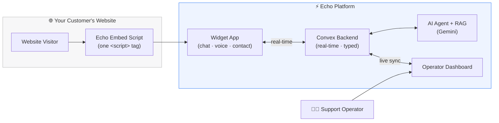
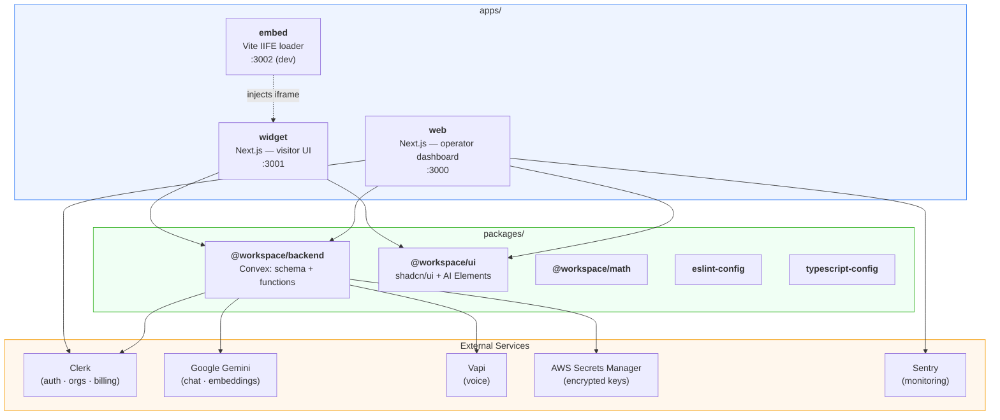
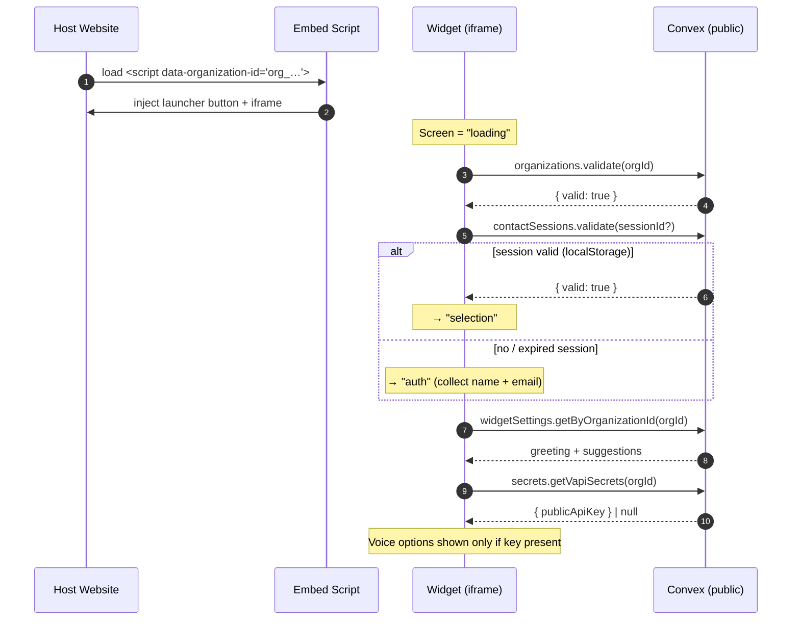
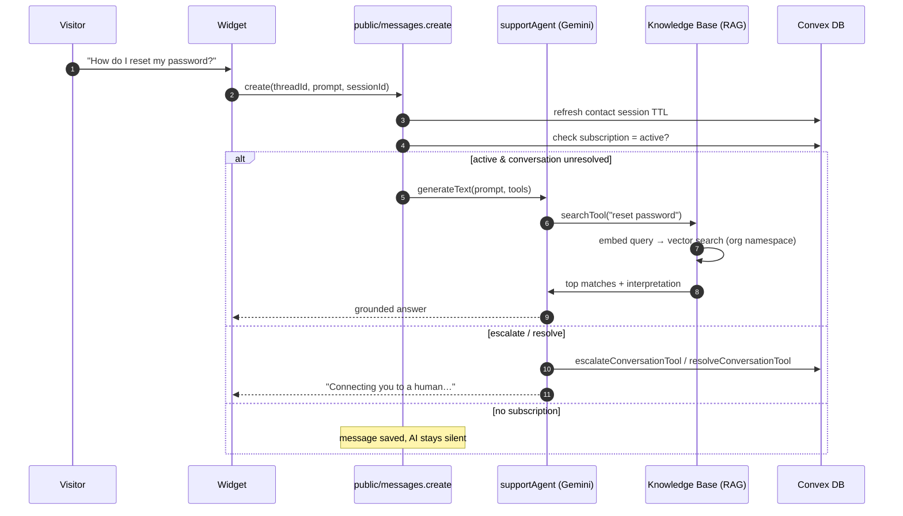
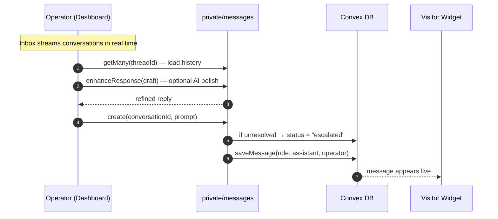
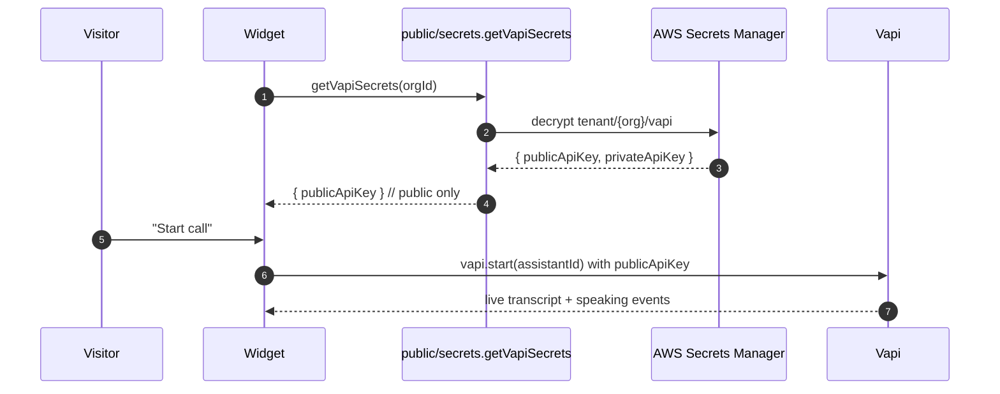
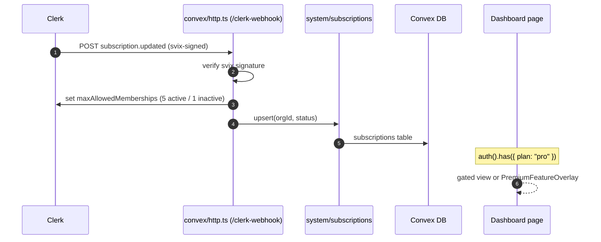
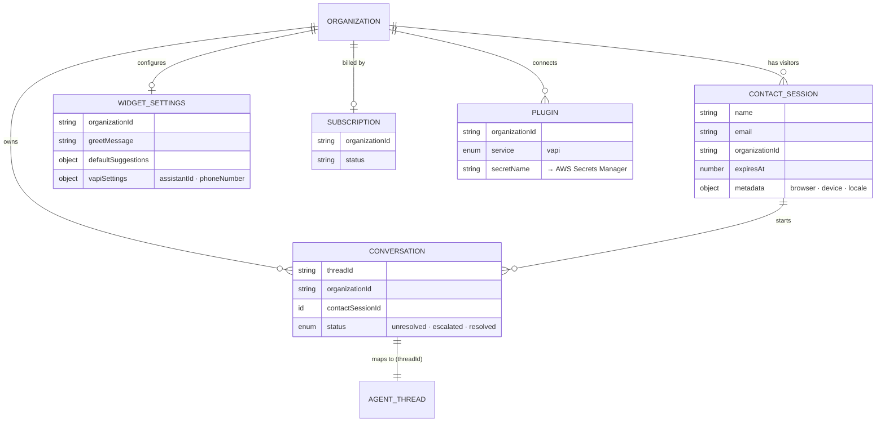

<div align="center">


# Echo

### The B2B AI‑Powered Customer Support Platform

**Drop one `<script>` tag on any website and give your customers a 24/7 AI support agent — over chat and voice — grounded in your own knowledge base, with a real‑time operator dashboard for seamless human takeover.**

[](https://github.com/RISHII7/echo/actions/workflows/ci.yml)
[](https://github.com/RISHII7/echo/actions/workflows/codeql.yml)
[](https://opensource.org/licenses/MIT)
[](https://nodejs.org)
[](https://pnpm.io)
[](https://www.typescriptlang.org)
[](https://nextjs.org)
[](https://turbo.build)
[](https://tailwindcss.com)
[](https://convex.dev)
[](https://clerk.com)
[](https://ai.google.dev)
[](https://vapi.ai)
[](https://sentry.io)

[**Product Overview**](docs/product-overview.md) · [**Documentation**](docs/README.md) · [**Architecture**](docs/architecture.md) · [**Report Bug**](https://github.com/RISHII7/echo/issues/new?template=bug_report.yml) · [**Request Feature**](https://github.com/RISHII7/echo/issues/new?template=feature_request.yml)

</div>

---

## Table of Contents

- [What is Echo?](#what-is-echo)
- [Why Echo](#why-echo)
- [Feature Tour](#feature-tour)
- [System Architecture](#system-architecture)
- [How It Works — Core Flows](#how-it-works--core-flows)
  - [1. Widget Bootstrap & Session Lifecycle](#1-widget-bootstrap--session-lifecycle)
  - [2. AI Conversation & RAG Pipeline](#2-ai-conversation--rag-pipeline)
  - [3. Human Operator Takeover](#3-human-operator-takeover)
  - [4. Voice Calls (Vapi)](#4-voice-calls-vapi)
  - [5. Billing & Subscription Gating](#5-billing--subscription-gating)
- [Data Model](#data-model)
- [Tech Stack](#tech-stack)
- [Monorepo Structure](#monorepo-structure)
- [Getting Started](#getting-started)
  - [Prerequisites](#prerequisites)
  - [1. Clone & Install](#1-clone--install)
  - [2. Provision External Services](#2-provision-external-services)
  - [3. Environment Variables](#3-environment-variables)
  - [4. Run the Stack](#4-run-the-stack)
- [Backend Function Reference](#backend-function-reference)
- [Embedding the Widget](#embedding-the-widget)
- [Deployment](#deployment)
- [Scripts & Tooling](#scripts--tooling)
- [Documentation](#documentation)
- [Roadmap](#roadmap)
- [Contributing](#contributing)
- [Security](#security)
- [Changelog](#changelog)
- [License](#license)

---

## What is Echo?

**Echo** is a multi‑tenant, AI‑powered customer support platform that companies embed on their websites to deflect support tickets and delight customers — without staffing a 24/7 team.

A visitor clicks the chat launcher on a customer's site and talks to an **AI agent** that:

- **Answers from your knowledge base**, not from generic training data — every answer is grounded in documents _you_ upload (retrieval‑augmented generation, or RAG).
- **Escalates to a human** the moment a customer is frustrated or explicitly asks for one.
- **Resolves and closes** conversations when the customer is satisfied.
- **Talks, literally** — the same widget can place a live **voice call** to an AI voice agent (powered by Vapi) or surface a real phone number.

Behind the scenes, your support operators work from a **real‑time dashboard**: a filterable inbox of every conversation, a full chat view with AI‑assisted reply drafting, and a rich contact panel showing exactly who they're talking to (device, browser, location, session history).

Echo is built as a **production‑grade Turborepo monorepo** — three deployable apps and a shared, fully‑typed Convex backend — so the entire system (widget → backend → dashboard) shares one source of truth end to end.



---

## Why Echo

| Pain today                                       | How Echo solves it                                                                                                               |
| ------------------------------------------------ | -------------------------------------------------------------------------------------------------------------------------------- |
| Support agents answer the same questions all day | An AI agent deflects repetitive questions 24/7, grounded in your docs                                                            |
| Chatbots hallucinate and invent policies         | RAG means answers come **only** from your uploaded knowledge base — "I don't know, want a human?" beats a confident wrong answer |
| Customers get stuck with a bot                   | Automatic escalation on frustration; instant human takeover from the dashboard                                                   |
| Voice support needs a call center                | One click launches an AI **voice** agent or reveals a real phone line                                                            |
| Integrating a widget means a sprint              | A single `<script>` tag. Copy‑paste snippets for HTML, React, Next.js, and JavaScript                                            |
| No visibility into who you're helping            | A contact panel with device, OS, browser, country, and session metadata for every visitor                                        |
| Rolling your own multi‑tenant SaaS is hard       | Clerk organizations, per‑org data isolation, plan‑based feature gating, and billing are built in                                 |

---

## Feature Tour

### 🧩 Embeddable Widget & Loader

- **One‑tag install** — a dependency‑free Vite/IIFE loader (`apps/embed`) injects a floating launcher button and an organization‑scoped `<iframe>` onto any page.
- **`window.EchoWidget` API** — `init()`, `show()`, `hide()`, `destroy()` for programmatic control, plus `postMessage`‑based `close`/`resize` coordination between host page and widget.
- **Configurable** — `data-organization-id` and `data-position` (`bottom-right` / `bottom-left`) attributes on the script tag.
- **Copy‑paste snippets** — the dashboard's **Integrations** page generates ready‑to‑paste embed code for HTML, React, Next.js, and JavaScript.

### 🤖 AI Support Agent

- **Grounded answers (RAG)** — powered by [`@convex-dev/agent`](https://www.npmjs.com/package/@convex-dev/agent) + [`@convex-dev/rag`](https://www.npmjs.com/package/@convex-dev/rag), using Google **Gemini 2.5 Flash** for chat and **`gemini-embedding-001`** for embeddings.
- **Tool‑calling agent** — the agent autonomously invokes three tools:
  - `searchTool` — semantic search over the organization's knowledge base with a dedicated result‑interpretation pass (never fabricates; offers a human when it can't find an answer).
  - `escalateConversationTool` — flags the conversation for a human on frustration or explicit request.
  - `resolveConversationTool` — closes the conversation when the customer is done.
- **Per‑conversation memory** — each conversation maps to an agent _thread_ with full, paginated message history.
- **Centralized prompt engineering** — identity, conversation flow, tone, and interpretation prompts live in `system/ai/constants`.

### 📚 Knowledge Base (RAG)

- **Multi‑format ingestion** — upload **PDF, CSV, and TXT** files; Gemini extracts text from images, PDFs, and HTML.
- **Organization‑namespaced** — each org's embeddings live in an isolated RAG namespace; **no cross‑tenant search leakage**.
- **Content‑hash deduplication** — re‑uploading unchanged content is a no‑op.
- **Managed in the dashboard** — a paginated file table with drag‑and‑drop upload and delete, backed by AWS‑storage‑aware size resolution.

### 📞 Voice AI (Vapi)

- **Live web voice calls** — the widget's voice screen streams a real‑time transcript with a speaking/listening indicator and start/end controls (`useVapi`).
- **Secure by design** — private Vapi keys are encrypted in **AWS Secrets Manager**; the widget only ever receives the _public_ key via a dedicated action.
- **Phone numbers** — the contact screen offers copy‑to‑clipboard and tap‑to‑call for a configured business line.
- **Dashboard management** — connect Vapi, then browse your assistants and phone numbers in tabbed tables.

### 🎛️ Operator Dashboard

- **Conversations inbox** — resizable, infinitely‑scrolling, status‑filterable (unresolved / escalated / resolved) list, with country‑flag avatars derived from the visitor's timezone.
- **Live chat view** — reply to any conversation through a full AI Elements chat UI; sending a reply auto‑escalates the conversation so the AI steps back.
- **AI "Enhance"** — one click rewrites an operator's draft into a polished, professional response (Gemini).
- **Contact panel** — avatar, email, "Send Email," and collapsible device / location / session metadata (browser, OS, screen, viewport, cookies, language, timezone, UTC offset) parsed with `bowser`.
- **Status control** — cycle a conversation through unresolved → escalated → resolved with a single button.

### 🔐 Multi‑Tenancy & Authentication

- **Clerk organizations** — every user belongs to an organization; **all data is partitioned by `organizationId`**.
- **Guarded routing** — Clerk middleware protects the dashboard, redirects org‑less users to an org‑selection flow, and `AuthGuard` + `OrganizationGuard` enforce it in the React tree.
- **Convex ↔ Clerk bridge** — `ConvexProviderWithClerk` passes Clerk JWTs to Convex so every backend function can trust `ctx.auth`.
- **Public vs. private vs. system** — backend functions are cleanly separated: **public** (widget‑facing, unauthenticated, scoped by org ID), **private** (dashboard, Clerk‑identity gated), and **system/internal** (never exposed to clients).

### 💳 Billing & Plan Gating

- **Clerk‑powered pricing** — an organization‑scoped `PricingTable` on the billing page.
- **Server‑side gating** — Knowledge Base, Voice Assistant, and Widget Customization pages check `auth().has({ plan: "pro" })` and render a `PremiumFeatureOverlay` upsell when the org isn't on Pro.
- **Subscription webhook** — a **signature‑verified** (`svix`) Clerk webhook syncs subscription status and adjusts the org's seat limit (5 seats when active, 1 otherwise).
- **Feature enforcement** — AI auto‑response, message enhancement, and file uploads all require an **active** subscription.

### 🛠️ Platform & Developer Experience

- **Turborepo monorepo** — topological task orchestration with caching across three apps and five packages.
- **End‑to‑end type safety** — Convex generates a fully‑typed API consumed by both Next.js apps.
- **Real‑time everywhere** — Convex live queries mean the dashboard updates the instant a visitor sends a message.
- **Error monitoring** — Sentry across client, server, and edge runtimes with session replay and tracing.
- **Quality gates** — ESLint 9, Prettier, TypeScript strict mode, CodeQL, Dependabot, and PR‑title validation in CI.

---

## System Architecture

Echo is a **workspace dependency graph**: two Next.js apps and one Vite loader consume shared packages, all built on a single Convex backend that owns the schema and every server function.



**Request‑path summary**

| Consumer                 | Talks to                            | Authorization                                                            |
| ------------------------ | ----------------------------------- | ------------------------------------------------------------------------ |
| **Widget** (visitor)     | `convex/public/*` functions         | Unauthenticated; scoped by `organizationId` + contact‑session validation |
| **Dashboard** (operator) | `convex/private/*` functions        | Clerk identity via `ctx.auth`, org‑matched                               |
| **Convex internals**     | `convex/system/*` functions         | `internal*` — never callable from a client                               |
| **Clerk**                | `convex/http.ts` (`/clerk-webhook`) | `svix` signature verification                                            |

For a deep dive, see [`docs/architecture.md`](docs/architecture.md).

---

## How It Works — Core Flows

### 1. Widget Bootstrap & Session Lifecycle

When the widget loads, it runs a **multi‑step state machine** (Jotai atoms) before showing a chat surface — validating the organization, restoring or creating a contact session, loading widget settings, and probing for voice capability.



**Screens:** `loading → error | auth | selection`, then `chat`, `voice`, `contact`, or `inbox`. Contact sessions carry a **24‑hour TTL that auto‑refreshes** whenever the visitor is active, so long conversations never expire mid‑chat.

### 2. AI Conversation & RAG Pipeline

A visitor's message triggers the AI agent — but only when the conversation is unresolved **and** the organization has an active subscription. The agent decides whether to search the knowledge base, answer, escalate, or resolve.



The `searchTool` runs a **two‑stage** RAG: a vector search over the org's namespace, then a second Gemini pass (`SEARCH_INTERPRETER_PROMPT`) that turns raw matches into a faithful, conversational answer — or a "I couldn't find that, want a human?" fallback.

### 3. Human Operator Takeover

Operators watch a live inbox and can jump into any conversation. Replying instantly escalates the conversation so the AI stops auto‑responding.



### 4. Voice Calls (Vapi)

If the organization has connected Vapi and configured an assistant, the widget's selection screen surfaces a **"Start voice call"** option.



### 5. Billing & Subscription Gating

Plans are managed by Clerk; a signed webhook keeps Convex in sync and drives feature access.



---

## Data Model

All business tables are partitioned by `organizationId` and indexed for the access patterns above. Convex generates fully‑typed accessors from this schema.



| Table             | Purpose                                                                       | Key indexes                                                                                    |
| ----------------- | ----------------------------------------------------------------------------- | ---------------------------------------------------------------------------------------------- |
| `contactSessions` | A widget visitor's identity + captured browser metadata; 24h TTL              | `by_organization_id`, `by_expires_at`                                                          |
| `conversations`   | Links a contact session to an agent thread with a resolution status           | `by_organization_id`, `by_thread_id`, `by_contact_session_id`, `by_status_and_organization_id` |
| `widgetSettings`  | Per‑org greeting, quick‑reply suggestions, Vapi assistant/phone selection     | `by_organization_id`                                                                           |
| `subscriptions`   | Mirror of the org's Clerk subscription status                                 | `by_organization_id`                                                                           |
| `plugins`         | Records that an org connected a service (Vapi); points to its AWS secret name | `by_organization_id`, `by_organization_id_and_service`                                         |
| `users`           | Scaffold table                                                                | —                                                                                              |

> Agent threads, messages, and RAG embeddings are managed by the `@convex-dev/agent` and `@convex-dev/rag` Convex components (registered in `convex.config.ts`), keyed by `threadId` and per‑org namespaces respectively.

See [`docs/data-model.md`](docs/data-model.md) for full field‑level detail.

---

## Tech Stack

| Layer             | Technology                                                                 |
| ----------------- | -------------------------------------------------------------------------- |
| **Monorepo**      | Turborepo 2 · pnpm 10 workspaces                                           |
| **Web framework** | Next.js 16 (App Router, RSC, Turbopack) · React 19                         |
| **Language**      | TypeScript 5 (strict)                                                      |
| **Styling**       | Tailwind CSS 4 · shadcn/ui · Radix UI · AI Elements                        |
| **Backend**       | Convex (real‑time DB, queries/mutations/actions, HTTP actions, components) |
| **Auth & Orgs**   | Clerk (organizations, JWT, billing, `PricingTable`)                        |
| **AI — chat**     | Google Gemini 2.5 Flash via `@ai-sdk/google` + `@convex-dev/agent`         |
| **AI — RAG**      | `@convex-dev/rag` · `gemini-embedding-001` embeddings                      |
| **Voice**         | Vapi (`@vapi-ai/web` client, `@vapi-ai/server-sdk`)                        |
| **Secrets**       | AWS Secrets Manager (`@aws-sdk/client-secrets-manager`)                    |
| **Webhooks**      | `svix` signature verification                                              |
| **Client state**  | Jotai (+ `jotai-family`)                                                   |
| **Forms**         | React Hook Form + Zod                                                      |
| **Widget loader** | Vite (IIFE library build)                                                  |
| **Monitoring**    | Sentry (client · server · edge, session replay)                            |
| **Tooling**       | ESLint 9 · Prettier 3 · Turbo · CodeQL · Dependabot · GitHub Actions       |

---

## Monorepo Structure

```
echo/
├── apps/
│   ├── web/                          # Operator dashboard (Next.js, :3000)
│   │   ├── app/
│   │   │   ├── (auth)/               # sign-in · sign-up · org-selection
│   │   │   ├── (dashboard)/          # conversations · files · plugins · customization · billing · integrations
│   │   │   ├── icon.svg              # Echo favicon
│   │   │   └── layout.tsx            # Clerk + Convex providers, metadata
│   │   ├── modules/                  # feature modules (auth, dashboard, files, plugins, customization, billing, integrations)
│   │   ├── proxy.ts                  # Clerk middleware (route protection + org redirect)
│   │   ├── instrumentation*.ts       # Sentry init
│   │   └── next.config.ts            # withSentryConfig
│   │
│   ├── widget/                       # Embeddable visitor widget (Next.js, :3001)
│   │   ├── app/                      # renders <WidgetView organizationId=…>
│   │   ├── modules/widget/
│   │   │   ├── atoms/                # Jotai state machine
│   │   │   ├── screens/              # loading · auth · selection · chat · voice · contact · inbox · error
│   │   │   ├── hooks/use-vapi.ts     # Vapi web client
│   │   │   └── constants · types
│   │   └── public/widget.js          # built embed loader (served at /widget.js)
│   │
│   └── embed/                        # Standalone widget loader (Vite IIFE, :3002)
│       ├── embed.ts                  # launcher + iframe + window.EchoWidget API
│       ├── config.ts · icons.ts
│       └── demo.html · landing.html  # playground + smoke test
│
├── packages/
│   ├── backend/convex/               # Convex backend (the system of record)
│   │   ├── schema.ts                 # all tables + indexes
│   │   ├── convex.config.ts          # registers agent + rag components
│   │   ├── http.ts                   # /clerk-webhook (svix)
│   │   ├── auth.config.ts            # Clerk JWT provider
│   │   ├── public/                   # widget-facing (unauthenticated)
│   │   ├── private/                  # dashboard (Clerk-identity gated)
│   │   ├── system/                   # internal + AI (agent, rag, tools, prompts)
│   │   └── lib/                      # secrets · text extraction
│   ├── ui/                           # shadcn/ui + Radix + AI Elements design system
│   ├── math/                         # shared utility package
│   ├── eslint-config/                # base · next · react-internal presets
│   └── typescript-config/            # base · nextjs · react-library presets
│
├── docs/                             # 📚 full documentation suite (see below)
├── CHANGELOG.md · CONTRIBUTING.md · SECURITY.md · CODE_OF_CONDUCT.md · LICENSE
└── turbo.json · pnpm-workspace.yaml
```

Feature modules follow a consistent shape — `ui/views`, `ui/components`, `ui/layouts`, plus `atoms`, `hooks`, `constants`, `schemas`, and `types` — keeping domain logic out of the Next.js routing layer.

---

## Getting Started

### Prerequisites

| Tool    | Version    | Notes                                            |
| ------- | ---------- | ------------------------------------------------ |
| Node.js | `>= 20`    | [fnm](https://github.com/Schniz/fnm) recommended |
| pnpm    | `>= 10.33` | `npm install -g pnpm` (repo pins `pnpm@10.33.4`) |
| Git     | Latest     | [git-scm.com](https://git-scm.com)               |

You will also need free/developer accounts for: **Convex**, **Clerk**, **Google AI (Gemini)**, and — for the optional voice + secrets features — **Vapi** and **AWS**.

### 1. Clone & Install

```bash
git clone https://github.com/RISHII7/echo.git
cd echo
pnpm install
```

### 2. Provision External Services

| Service                                             | What to create                                                                                                 | Used for                               |
| --------------------------------------------------- | -------------------------------------------------------------------------------------------------------------- | -------------------------------------- |
| **[Convex](https://convex.dev)**                    | A project (`pnpm --filter backend dev` provisions a dev deployment)                                            | Database, functions, HTTP actions      |
| **[Clerk](https://clerk.com)**                      | An application with **Organizations** enabled, a JWT template named `convex`, and (for billing) a **Pro** plan | Auth, multi‑tenancy, billing, webhooks |
| **[Google AI Studio](https://aistudio.google.com)** | An API key                                                                                                     | Gemini chat + embeddings               |
| **[Vapi](https://vapi.ai)** _(optional)_            | An assistant + public/private API keys                                                                         | Voice calls                            |
| **[AWS](https://aws.amazon.com)** _(optional)_      | An IAM user with `secretsmanager:CreateSecret`, `PutSecretValue`, `GetSecretValue`                             | Encrypted plugin credentials           |
| **[Sentry](https://sentry.io)** _(optional)_        | A project + auth token                                                                                         | Error monitoring                       |

> Convex functions run on Convex's servers, so secrets they need (`CLERK_SECRET_KEY`, `CLERK_WEBHOOK_SECRET`, `GOOGLE_GENERATIVE_AI_API_KEY`, `AWS_*`) must be set in the **Convex dashboard** (or via `npx convex env set`), not only in `.env.local`.

### 3. Environment Variables

**`apps/web/.env.local`**

| Variable                            | Description                                                 |
| ----------------------------------- | ----------------------------------------------------------- |
| `NEXT_PUBLIC_CONVEX_URL`            | Convex deployment URL (`https://<deployment>.convex.cloud`) |
| `NEXT_PUBLIC_CLERK_PUBLISHABLE_KEY` | Clerk publishable key (`pk_test_…`)                         |
| `CLERK_SECRET_KEY`                  | Clerk secret key (`sk_test_…`)                              |

**`apps/widget/.env.local`**

| Variable                 | Description                               |
| ------------------------ | ----------------------------------------- |
| `NEXT_PUBLIC_CONVEX_URL` | Same Convex deployment URL as the web app |

**`packages/backend` — set in the Convex dashboard** (auto‑managed `.env.local` for CLI):

| Variable                                                   | Description                                                   |
| ---------------------------------------------------------- | ------------------------------------------------------------- |
| `CONVEX_DEPLOYMENT`                                        | Convex deployment identifier (auto)                           |
| `CLERK_JWT_ISSUER_DOMAIN`                                  | Clerk JWT issuer URL for Convex auth                          |
| `CLERK_SECRET_KEY`                                         | Used by the `/clerk-webhook` HTTP action and Vapi/org actions |
| `CLERK_WEBHOOK_SECRET`                                     | Clerk webhook signing secret (verified via `svix`)            |
| `GOOGLE_GENERATIVE_AI_API_KEY`                             | Gemini chat + embeddings                                      |
| `AWS_REGION`, `AWS_ACCESS_KEY_ID`, `AWS_SECRET_ACCESS_KEY` | AWS Secrets Manager (voice/plugins)                           |

**`apps/web/.env.sentry-build-plugin`** _(optional, gitignored)_

| Variable            | Description                  |
| ------------------- | ---------------------------- |
| `SENTRY_AUTH_TOKEN` | Uploads source maps on build |

### 4. Run the Stack

```bash
# Everything (Convex + web + widget) via Turborepo
pnpm dev

# …or individually
pnpm --filter backend dev   # Convex dev server (provisions deployment on first run)
pnpm --filter web dev       # Dashboard  → http://localhost:3000
pnpm --filter widget dev    # Widget      → http://localhost:3001
pnpm --filter embed dev     # Embed demo  → http://localhost:3002/demo.html
```

Open the dashboard, create an organization, upload a document under **Knowledge Base**, then open the widget with your org ID:

```
http://localhost:3001/?organizationId=org_XXXXXXXXXXXXXXXXXXXX
```

A full, screenshot‑guided walkthrough lives in [`docs/setup.md`](docs/setup.md).

---

## Backend Function Reference

Convex functions are grouped by trust boundary. **Public** functions are callable from the unauthenticated widget (and validate org/session themselves); **private** functions require a Clerk identity; **system** functions are `internal*` and only callable from other Convex functions.

<details>
<summary><b>public/</b> — widget-facing (unauthenticated, org-scoped)</summary>

| Function                             | Kind     | Description                                                                        |
| ------------------------------------ | -------- | ---------------------------------------------------------------------------------- |
| `organizations.validate`             | action   | Verifies an org ID exists in Clerk                                                 |
| `contactSessions.create`             | mutation | Creates a visitor session (name, email, browser metadata, 24h TTL)                 |
| `contactSessions.validate`           | mutation | Checks a stored session is present and unexpired                                   |
| `conversations.create`               | mutation | Refreshes session, seeds an agent thread with the greeting, creates a conversation |
| `conversations.getOne`               | query    | Fetches a conversation (ownership‑verified by session)                             |
| `conversations.getMany`              | query    | Paginated conversation list for a contact session, with last message               |
| `messages.create`                    | action   | Saves a visitor message; triggers the AI agent when unresolved + subscribed        |
| `messages.getMany`                   | query    | Paginated thread messages                                                          |
| `widgetSettings.getByOrganizationId` | query    | Greeting + suggestions + Vapi settings for the widget                              |
| `secrets.getVapiSecrets`             | action   | Returns **only** the Vapi public key for the org                                   |

</details>

<details>
<summary><b>private/</b> — dashboard (Clerk-identity gated)</summary>

| Function                                          | Kind             | Description                                                                      |
| ------------------------------------------------- | ---------------- | -------------------------------------------------------------------------------- |
| `conversations.getMany`                           | query            | Org‑scoped, status‑filterable, paginated inbox with contact + last message       |
| `conversations.getOne`                            | query            | Single conversation with its contact session                                     |
| `conversations.updateStatus`                      | mutation         | Set unresolved / escalated / resolved                                            |
| `messages.create`                                 | mutation         | Operator reply (auto‑escalates the conversation)                                 |
| `messages.getMany`                                | query            | Thread history for the dashboard chat view                                       |
| `messages.enhanceResponse`                        | action           | Gemini rewrite of an operator draft (subscription‑gated)                         |
| `contactSessions.getOneByConversationId`          | query            | Contact record behind a conversation (contact panel)                             |
| `files.addFile`                                   | action           | Extract → embed → index a file into the org's RAG namespace (subscription‑gated) |
| `files.deleteFile`                                | mutation         | Remove a knowledge‑base entry + its storage blob                                 |
| `files.list`                                      | query            | Paginated knowledge‑base file table                                              |
| `plugins.getOne` / `plugins.remove`               | query / mutation | Plugin connection state                                                          |
| `secrets.upsert`                                  | mutation         | Schedules encrypted storage of service credentials                               |
| `vapi.getAssistants` / `vapi.getPhoneNumbers`     | action           | List Vapi resources via the server SDK                                           |
| `widgetSettings.getOne` / `widgetSettings.upsert` | query / mutation | Read/write widget configuration                                                  |

</details>

<details>
<summary><b>system/</b> — internal + AI</summary>

| Module                                                                                | Description                                                    |
| ------------------------------------------------------------------------------------- | -------------------------------------------------------------- |
| `ai/agents/supportAgent`                                                              | The Gemini‑backed `@convex-dev/agent` instance + system prompt |
| `ai/rag`                                                                              | The `@convex-dev/rag` instance (`gemini-embedding-001`)        |
| `ai/tools/{search,escalateConversation,resolveConversation}`                          | Agent tools                                                    |
| `ai/constants`                                                                        | Support‑agent, search‑interpreter, and enhancement prompts     |
| `subscriptions.{upsert,getByOrganizationId}`                                          | Subscription mirror                                            |
| `plugins.{upsert,getByOrganizationIdAndService}`                                      | Plugin registry                                                |
| `secrets.upsert`                                                                      | Writes to AWS Secrets Manager + records the plugin             |
| `contactSessions.{refresh,getOne}` · `conversations.{escalate,resolve,getByThreadId}` | Session TTL + conversation state                               |

</details>

Full signatures and argument validators are documented in [`docs/backend-api.md`](docs/backend-api.md).

---

## Embedding the Widget

Once an organization exists, embedding Echo on any website is one tag:

```html
<script
  src="https://YOUR_WIDGET_HOST/widget.js"
  data-organization-id="org_XXXXXXXXXXXXXXXXXXXX"
  data-position="bottom-right"
></script>
```

The loader injects a floating launcher and an organization‑scoped iframe, and exposes a programmatic API:

```js
// Reinitialize with new config, or control visibility
window.EchoWidget.init({ organizationId: "org_…", position: "bottom-left" })
window.EchoWidget.show()
window.EchoWidget.hide()
window.EchoWidget.destroy()
```

The dashboard's **Integrations** page generates copy‑paste snippets for HTML, React, Next.js, and JavaScript. See [`docs/embedding.md`](docs/embedding.md).

---

## Deployment

Echo has four deployable units. A typical production topology:

| Unit                            | Recommended host                                            | Notes                                                                                                  |
| ------------------------------- | ----------------------------------------------------------- | ------------------------------------------------------------------------------------------------------ |
| **Convex backend**              | Convex Cloud (`npx convex deploy`)                          | Set all backend env vars in the Convex dashboard; register the Clerk webhook at `<site>/clerk-webhook` |
| **Dashboard** (`apps/web`)      | Vercel (root `apps/web`)                                    | Add `NEXT_PUBLIC_*` + Clerk keys                                                                       |
| **Widget** (`apps/widget`)      | Vercel (root `apps/widget`)                                 | Serves `/widget.js`; add `NEXT_PUBLIC_CONVEX_URL`                                                      |
| **Embed loader** (`apps/embed`) | Any static/CDN host, or bundled into the widget's `public/` | Build with `pnpm --filter embed build`                                                                 |

> **Before going live**, replace the hard‑coded `http://localhost:3001` in the embed loader / integration snippets with your production widget host (via `VITE_WIDGET_URL` for the embed build and the `*_SCRIPT` constants in `apps/web/modules/integrations/constants`).

Step‑by‑step deployment (including the Clerk webhook and Convex env setup) is in [`docs/deployment.md`](docs/deployment.md).

---

## Scripts & Tooling

```bash
pnpm dev          # Run all apps + Convex (Turborepo)
pnpm build        # Build every app and package in topological order
pnpm lint         # ESLint across all workspaces
pnpm typecheck    # tsc --noEmit across all workspaces
pnpm format       # Prettier write across all workspaces

pnpm --filter web dev        # Target one workspace
pnpm --filter backend dev    # Convex only
```

- **Branching** — Git Flow: `feature/*` → PR to `develop` → `release/*` → PR to `main`.
- **Commits** — [Conventional Commits](https://www.conventionalcommits.org); PR titles validated in CI.
- **CI** — format, lint, typecheck, build, CodeQL, and PR‑title checks on every pull request.

---

## Documentation

The `docs/` directory contains the full, diagram‑rich documentation set:

| Document                                                     | What's inside                                                             |
| ------------------------------------------------------------ | ------------------------------------------------------------------------- |
| [**Product Overview**](docs/product-overview.md)             | Non‑technical, client‑facing tour of what Echo does and why it's valuable |
| [**Architecture**](docs/architecture.md)                     | System design, trust boundaries, request paths, component diagrams        |
| [**Data Model**](docs/data-model.md)                         | Every table, field, index, and relationship (with ERD)                    |
| [**Authentication & Multi‑Tenancy**](docs/authentication.md) | Clerk ↔ Convex bridge, guards, org isolation                              |
| [**AI Agent & RAG**](docs/ai-agent.md)                       | Agent, tools, prompts, embeddings, and the retrieval pipeline             |
| [**Conversation Flows**](docs/conversation-flows.md)         | End‑to‑end message, escalation, and resolution sequences                  |
| [**Widget & Embed**](docs/widget.md)                         | State machine, screens, and the embed loader                              |
| [**Voice (Vapi)**](docs/voice.md)                            | Connection, secret handling, and the call lifecycle                       |
| [**Billing & Subscriptions**](docs/billing.md)               | Plans, gating, and the webhook                                            |
| [**Backend API Reference**](docs/backend-api.md)             | Every Convex function, with args and behavior                             |
| [**Setup Guide**](docs/setup.md)                             | Step‑by‑step local environment                                            |
| [**Deployment Guide**](docs/deployment.md)                   | Production rollout                                                        |

Start at [`docs/README.md`](docs/README.md).

---

## Roadmap

- [ ] Framework‑specific embed snippets (React/Next.js component wrappers)
- [ ] Widget disconnect/reconnect UX polish for the Vapi plugin
- [ ] Environment‑driven widget host (remove `localhost` from shipped snippets)
- [ ] Analytics: deflection rate, CSAT, resolution time
- [ ] Team roles & permissions beyond organization membership

---

## Contributing

Contributions are welcome! Please read [CONTRIBUTING.md](CONTRIBUTING.md) and the [Code of Conduct](CODE_OF_CONDUCT.md) before opening a pull request. In short: branch from `develop`, follow Conventional Commits, and make sure `pnpm lint`, `pnpm typecheck`, and `pnpm build` pass.

## Security

Please read [SECURITY.md](SECURITY.md) before reporting a vulnerability. **Do not open a public issue for security vulnerabilities.**

## Changelog

All notable changes are documented in [CHANGELOG.md](CHANGELOG.md), following [Keep a Changelog](https://keepachangelog.com) and [Semantic Versioning](https://semver.org).

## License

Distributed under the MIT License. See [LICENSE](LICENSE) for details.

---

<div align="center">


**Echo** — AI‑powered customer support that actually knows your product.

Made with precision by [Rishikesh Palande](https://github.com/RISHII7)

</div>
