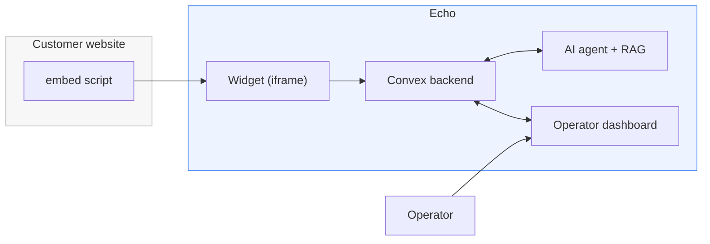

# Echo Documentation

**Everything you need to understand, run, extend, and sell Echo.**

---

Welcome to the Echo documentation set. These documents are written to be read on their own or in sequence, and every architectural concept is accompanied by a diagram. If you're new here, start with the **Product Overview** (what Echo is and why it matters) and then the **Architecture** doc (how it's built).

## For everyone

| Document                                    | Read this if you want to…                                                                                                           |
| ------------------------------------------- | ----------------------------------------------------------------------------------------------------------------------------------- |
| [**Product Overview**](product-overview.md) | Understand what Echo does, who it's for, and the value it delivers — no code required. Ideal for clients, buyers, and stakeholders. |

## For engineers

| Document                                                | Read this if you want to…                                                      |
| ------------------------------------------------------- | ------------------------------------------------------------------------------ |
| [**Architecture**](architecture.md)                     | See the whole system: apps, packages, trust boundaries, and request paths.     |
| [**Data Model**](data-model.md)                         | Know every table, field, index, and relationship.                              |
| [**Authentication & Multi‑Tenancy**](authentication.md) | Understand how Clerk, organizations, and Convex auth fit together.             |
| [**AI Agent & RAG**](ai-agent.md)                       | Learn how the agent, tools, prompts, and retrieval pipeline work.              |
| [**Conversation Flows**](conversation-flows.md)         | Trace a message end‑to‑end: visitor → AI → escalation → operator → resolution. |
| [**Widget & Embed**](widget.md)                         | Understand the widget state machine and the one‑tag embed loader.              |
| [**Voice (Vapi)**](voice.md)                            | Wire up and understand voice calls and secret handling.                        |
| [**Billing & Subscriptions**](billing.md)               | Understand plans, gating, and the subscription webhook.                        |
| [**Backend API Reference**](backend-api.md)             | Look up any Convex function, its args, and behavior.                           |

## For operators / DevOps

| Document                                 | Read this if you want to…                           |
| ---------------------------------------- | --------------------------------------------------- |
| [**Setup Guide**](setup.md)              | Get a full local environment running, step by step. |
| [**Deployment Guide**](deployment.md)    | Ship every unit to production.                      |
| [**Embedding the Widget**](embedding.md) | Put Echo on a customer's website.                   |

---

## The 60‑second mental model

1. A customer embeds a **one‑line script** on their site.
2. It renders the **Echo widget** in an iframe, scoped to their **organization**.
3. Visitors chat (or call) an **AI agent** that answers from the org's **knowledge base**.
4. The agent **escalates to a human** when needed; operators take over from the **dashboard**.
5. Everything is **real‑time**, **multi‑tenant**, and **subscription‑gated**.

---

_Docs are versioned alongside the code. If something here disagrees with the source, the source wins — please open a PR to fix the doc._
