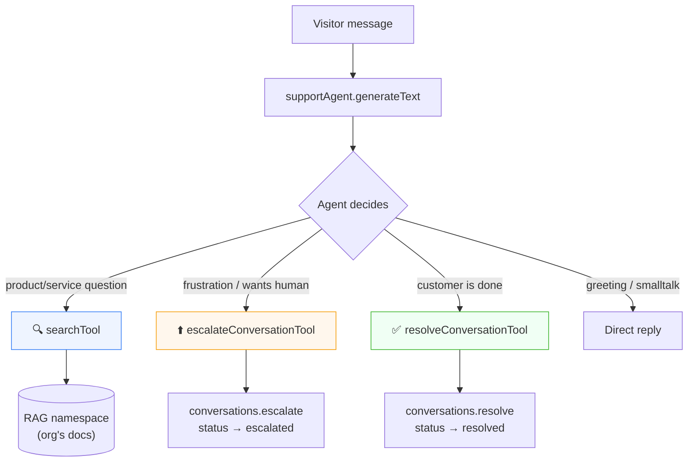
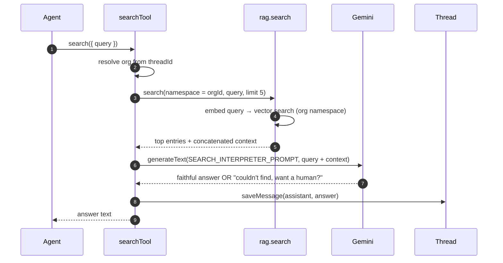
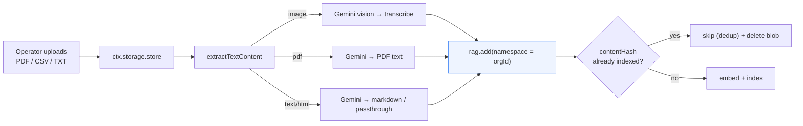
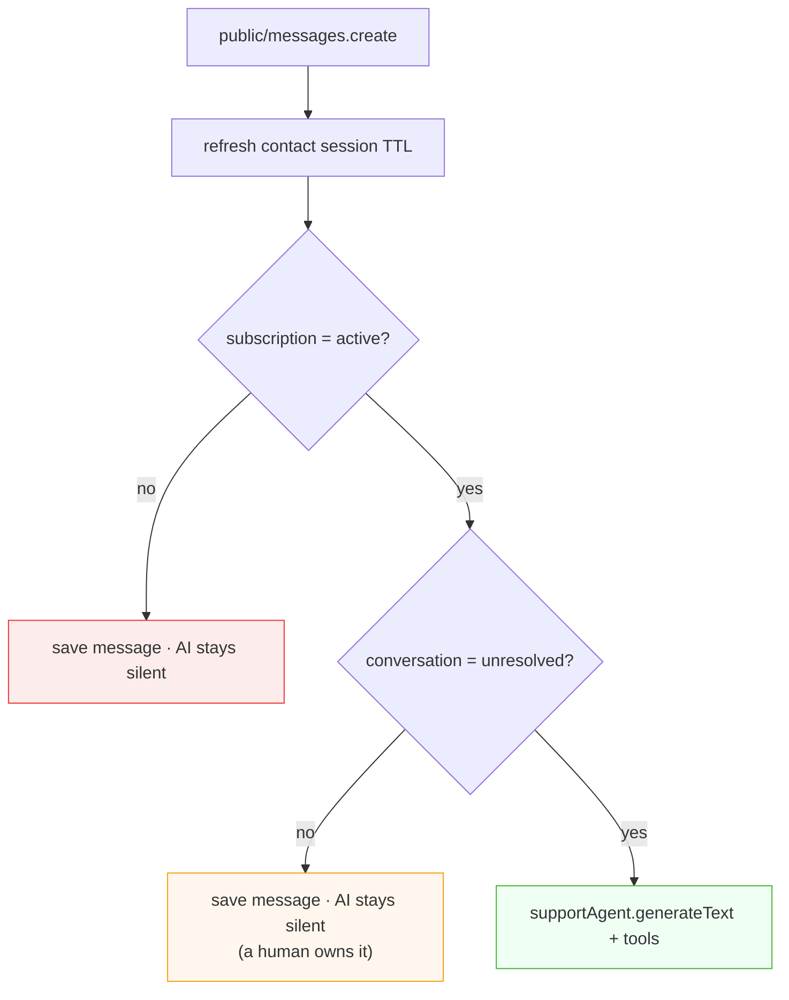
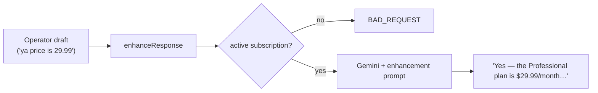

# AI Agent & RAG

Echo's intelligence lives in the Convex backend under `system/ai/`. It combines the [`@convex-dev/agent`](https://www.npmjs.com/package/@convex-dev/agent) component (a tool‑calling chat agent) with [`@convex-dev/rag`](https://www.npmjs.com/package/@convex-dev/rag) (retrieval‑augmented generation over your documents), both powered by **Google Gemini**.

---

## Table of Contents

- [Components](#components)
- [The support agent](#the-support-agent)
- [The three tools](#the-three-tools)
- [The RAG pipeline](#the-rag-pipeline)
- [Knowledge base ingestion](#knowledge-base-ingestion)
- [Prompts](#prompts)
- [When the agent runs (and when it doesn't)](#when-the-agent-runs-and-when-it-doesnt)
- [Message enhancement](#message-enhancement)
- [Models & configuration](#models--configuration)

---

## Components

Both AI capabilities are Convex **components**, registered once in [`convex.config.ts`](../packages/backend/convex/convex.config.ts):

```ts
const app = defineApp()
app.use(agent) // @convex-dev/agent — threads, messages, tool-calling
app.use(rag) // @convex-dev/rag  — embeddings, namespaces, vector search
export default app
```

- **agent** owns conversation _threads_ and _messages_ (keyed by `threadId`).
- **rag** owns document _embeddings_, organized into per‑organization _namespaces_.

---

## The support agent

Defined in [`system/ai/agents/supportAgent.ts`](../packages/backend/convex/system/ai/agents/supportAgent.ts):

```ts
export const supportAgent = new Agent(components.agent, {
  chat: google.chat("gemini-2.5-flash"),
  instructions: SUPPORT_AGENT_PROMPT,
})
```

It's a single agent instance used across the whole platform. It:

- **Creates a thread** per conversation (`supportAgent.createThread`), seeded with the org's greeting.
- **Generates responses** with tools available (`supportAgent.generateText(ctx, { threadId }, { prompt, tools })`).
- **Lists messages** for the chat UIs (`supportAgent.listMessages`).
- **Saves messages** directly when a human or a tool posts (`supportAgent.saveMessage` / `saveMessage(ctx, components.agent, …)`).

---

## The three tools

The agent is given three tools and decides, per turn, whether to call one. All live in [`system/ai/tools/`](../packages/backend/convex/system/ai/tools/) and are wired into `public/messages.create` as `searchTool`, `escalateConversationTool`, and `resolveConversationTool`.



| Tool                       | Trigger                                                | Effect                                                                                        |
| -------------------------- | ------------------------------------------------------ | --------------------------------------------------------------------------------------------- |
| **`search`**               | Any product/service question                           | Runs RAG over the org namespace, interprets results, posts a grounded answer                  |
| **`escalateConversation`** | Frustration or explicit request for a human            | Looks up the conversation by `threadId`, patches status → `escalated`, posts a system message |
| **`resolveConversation`**  | Customer signals they're done ("thanks", "that's all") | Patches status → `resolved`, posts a system message                                           |

Both `escalate` and `resolve` tools resolve the conversation via `internal.system.conversations.getByThreadId` and call the corresponding internal mutation.

---

## The RAG pipeline

The `search` tool is a **two‑stage** retrieval + interpretation pipeline — this is what keeps answers grounded and prevents hallucination.



**Stage 1 — retrieve.** `rag.search` embeds the query and finds the top 5 matching chunks, scoped to the organization's namespace. Results include entry titles and a concatenated context block.

**Stage 2 — interpret.** A second Gemini call, guided by `SEARCH_INTERPRETER_PROMPT`, turns the raw context into a natural answer. The prompt is strict: **use only what's in the results; never invent steps or details; if nothing relevant is found, respond with the exact "I couldn't find… want a human?" line.**

The interpreted answer is saved to the thread and returned to the agent, which relays it to the visitor.

---

## Knowledge base ingestion

Documents become searchable through `private/files.addFile` (dashboard upload), which extracts text and indexes it into the org's RAG namespace.



- **Extraction** ([`lib/extractTextContent.ts`](../packages/backend/convex/lib/extractTextContent.ts)) routes by MIME type to Gemini 2.5 Flash: images are transcribed/described, PDFs are read natively, and non‑plain text is converted to markdown (plain text passes through).
- **Namespacing** — `rag.add` is called with `namespace: orgId`, so every org's knowledge is isolated.
- **Deduplication** — a `contentHash` (from the file bytes) means re‑uploading identical content is a no‑op (and the redundant storage blob is deleted).
- **Metadata** — each entry stores `storageId`, `uploadedBy` (org), `filename`, and `category`, used by `files.list` to render the dashboard table and by `files.deleteFile` to clean up.

Both ingestion and search require an **active subscription** (`addFile` checks `subscriptions`), so RAG is a Pro‑tier capability.

---

## Prompts

All prompts are centralized in [`system/ai/constants/index.ts`](../packages/backend/convex/system/ai/constants/index.ts):

| Constant                              | Governs                                  | Key rules                                                                                                                           |
| ------------------------------------- | ---------------------------------------- | ----------------------------------------------------------------------------------------------------------------------------------- |
| `SUPPORT_AGENT_PROMPT`                | The agent's overall behavior             | Search first for any product question; escalate on frustration; resolve when done; never invent information; one question at a time |
| `SEARCH_INTERPRETER_PROMPT`           | Stage‑2 interpretation of search results | Use only retrieved content; be specific and conversational; on no match, return the exact human‑handoff line                        |
| `OPERATOR_MESSAGE_ENHANCEMENT_PROMPT` | The "Enhance" feature                    | Improve professionalism/clarity while preserving intent, specifics, and tone; return only the rewritten message                     |

Centralizing prompts keeps agent behavior consistent and reviewable in one place.

---

## When the agent runs (and when it doesn't)

The AI **auto‑responds only** when a visitor message meets **both** conditions in `public/messages.create`:



- **No active subscription** → the message is saved but the AI does nothing (human‑only support still works).
- **Conversation escalated/resolved** → a human has taken over, so the AI won't barge in.
- **Unresolved + subscribed** → the agent runs with all three tools available.

This is why an operator replying (which escalates the conversation) cleanly pauses the AI.

---

## Message enhancement

Separate from the agent, `private/messages.enhanceResponse` is an operator convenience: it takes a rough draft and returns a polished version via a direct Gemini call with `OPERATOR_MESSAGE_ENHANCEMENT_PROMPT`. It is **subscription‑gated** and identity‑checked, and surfaces a toast on failure in the dashboard.



---

## Models & configuration

| Purpose         | Model                                    | Package                                |
| --------------- | ---------------------------------------- | -------------------------------------- |
| Chat / agent    | `gemini-2.5-flash`                       | `@ai-sdk/google`                       |
| Text extraction | `gemini-2.5-flash` (multimodal)          | `@ai-sdk/google`                       |
| Embeddings      | `gemini-embedding-001` (1536‑dim output) | `@ai-sdk/google` via `@convex-dev/rag` |

Configuration requires `GOOGLE_GENERATIVE_AI_API_KEY` in the Convex environment. The embedding model is pinned to a 1536‑dimension output to match the RAG index configuration.

---

**Next:** [Conversation Flows](conversation-flows.md) · [Backend API Reference](backend-api.md) · [Billing & Subscriptions](billing.md)
