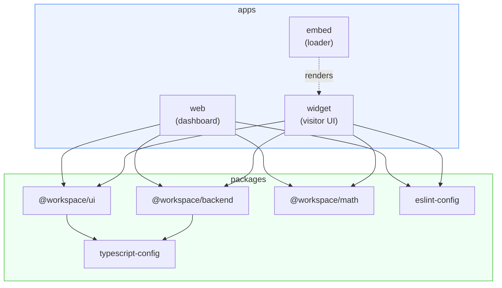
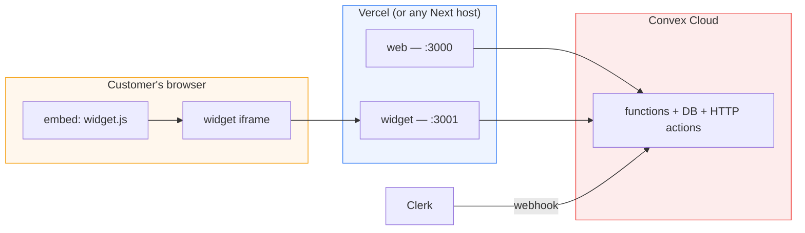
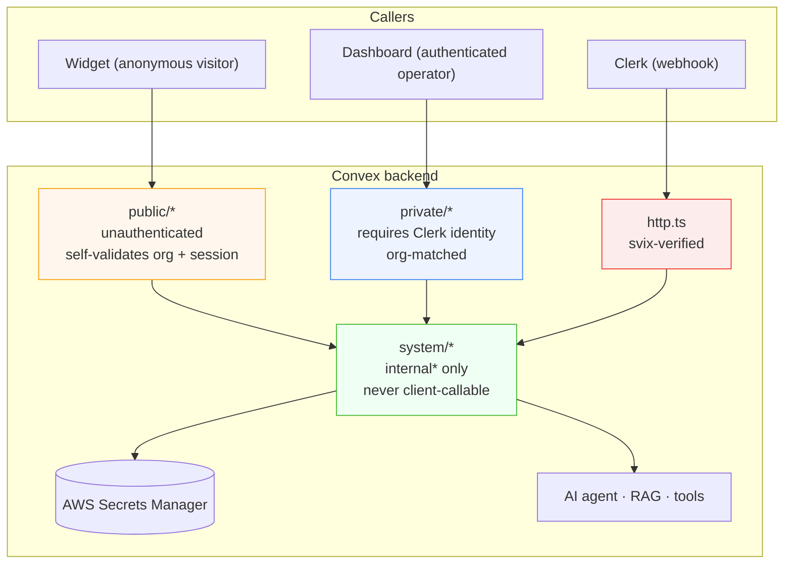
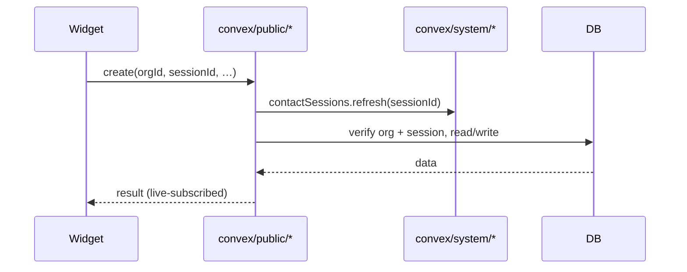
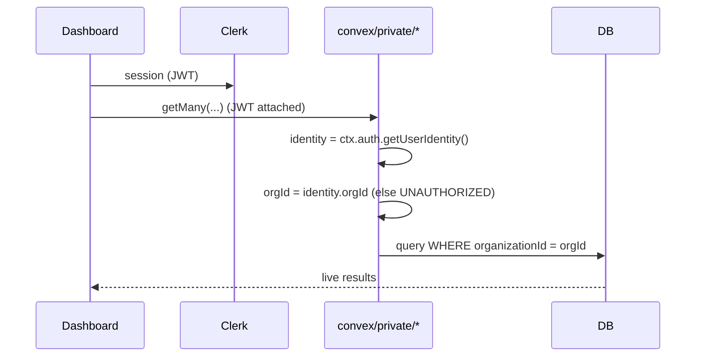
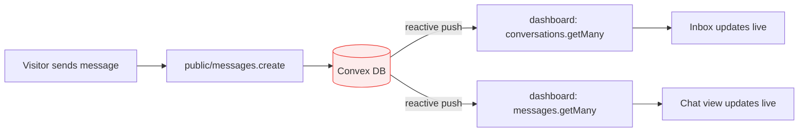
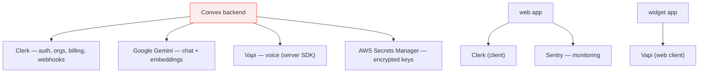

# Architecture

This document explains how Echo is put together: the apps, the shared packages, the backend trust boundaries, and how a request travels through the system.

> **Prerequisite reading:** the [Product Overview](product-overview.md) for _what_ Echo does. This doc covers _how_.

---

## Table of Contents

- [Design principles](#design-principles)
- [The monorepo at a glance](#the-monorepo-at-a-glance)
- [Deployable units](#deployable-units)
- [The backend trust model](#the-backend-trust-model)
- [Request paths](#request-paths)
- [Real‑time data flow](#real-time-data-flow)
- [State management](#state-management)
- [External services](#external-services)
- [Cross‑cutting concerns](#cross-cutting-concerns)

---

## Design principles

1. **One source of truth.** The Convex backend owns the schema and every server function. Both front‑end apps consume the _same_ generated, fully‑typed API — there is no separate REST layer to drift.
2. **Trust boundaries are explicit.** Backend functions live in `public/`, `private/`, or `system/` folders that _encode_ who may call them. This is architecture, not convention.
3. **Multi‑tenancy is pervasive.** Every business record carries an `organizationId`. Isolation is enforced in every query, mutation, and RAG namespace.
4. **Feature modules, not god components.** Each domain (auth, dashboard, files, plugins, billing, …) is a self‑contained module with its own views, components, atoms, and types.
5. **Real‑time by default.** Convex live queries push updates to the dashboard the instant data changes — no polling, no websocket plumbing to maintain.

---

## The monorepo at a glance

Echo is a **Turborepo** managed with **pnpm workspaces**. Apps consume packages; packages can consume other packages; Turbo runs tasks in topological order with caching.

| Workspace                    | Type        | Responsibility                                                                                        |
| ---------------------------- | ----------- | ----------------------------------------------------------------------------------------------------- |
| `apps/web`                   | Next.js 16  | Operator dashboard (auth, inbox, chat, knowledge base, plugins, customization, billing, integrations) |
| `apps/widget`                | Next.js 16  | The visitor‑facing chat/voice UI, rendered inside an iframe                                           |
| `apps/embed`                 | Vite (IIFE) | The standalone loader script that injects the widget onto any website                                 |
| `packages/backend`           | Convex      | Schema + all server functions + AI/RAG components; the system of record                               |
| `packages/ui`                | Library     | shadcn/ui + Radix + AI Elements design system, shared by both apps                                    |
| `packages/math`              | Library     | Small shared utilities                                                                                |
| `packages/eslint-config`     | Config      | `base`, `next`, `react-internal` ESLint presets                                                       |
| `packages/typescript-config` | Config      | `base`, `nextjs`, `react-library` tsconfig presets                                                    |

Turbo task graph (from `turbo.json`): `build` depends on upstream `^build`; `lint`, `typecheck`, and `format` fan out across workspaces; `dev` is persistent and uncached.

---

## Deployable units

Echo ships as **four independent units**. They can scale and deploy separately.

| Unit      | Dev port   | Prod host (typical)                                   |
| --------- | ---------- | ----------------------------------------------------- |
| `web`     | 3000       | Vercel (root `apps/web`)                              |
| `widget`  | 3001       | Vercel (root `apps/widget`); also serves `/widget.js` |
| `embed`   | 3002       | Static/CDN, or bundled into the widget's `public/`    |
| `backend` | Convex dev | Convex Cloud (`npx convex deploy`)                    |

---

## The backend trust model

The single most important architectural idea in Echo: **the folder a Convex function lives in determines who can call it.**

| Layer          | Auth expectation                                                                                                                                   | Example                         |
| -------------- | -------------------------------------------------------------------------------------------------------------------------------------------------- | ------------------------------- |
| **`public/`**  | None. The caller is an anonymous website visitor. Each function **validates the organization and/or contact session itself** before touching data. | `public/messages.create`        |
| **`private/`** | A Clerk identity via `ctx.auth.getUserIdentity()`. The function reads `orgId` from the identity and refuses cross‑org access.                      | `private/conversations.getMany` |
| **`system/`**  | Internal only (`internalQuery` / `internalMutation` / `internalAction`). Callable **only** from other Convex functions, never from a browser.      | `system/subscriptions.upsert`   |
| **`http.ts`**  | An HTTP action verifying a **`svix`** webhook signature before trusting the payload.                                                               | `/clerk-webhook`                |

This is why the widget can be fully anonymous yet safe: `public/` functions never trust the caller — they re‑derive and re‑validate everything (org exists in Clerk, session isn't expired, conversation belongs to the session) on every call.

---

## Request paths

### Widget → backend (anonymous, org‑scoped)

The widget knows only an `organizationId` (from its iframe URL). It calls `public/*` functions, which validate the org and the contact session on every request.

### Dashboard → backend (authenticated, org‑matched)

The dashboard is wrapped in `ConvexProviderWithClerk`, so Clerk JWTs ride along with every call. `private/*` functions read the caller's `orgId` from the verified identity.

---

## Real‑time data flow

Convex queries are **reactive**: when a mutation changes data a query depends on, every subscribed client re‑renders automatically. This is what makes an operator's inbox update the instant a visitor sends a message.

No polling, no manual cache invalidation, no socket server to operate — subscription and invalidation are handled by Convex.

---

## State management

Two very different state models, chosen deliberately:

| App                 | Model                                                                                                         | Why                                                                                                           |
| ------------------- | ------------------------------------------------------------------------------------------------------------- | ------------------------------------------------------------------------------------------------------------- |
| **web** (dashboard) | Convex live queries + small Jotai atoms (e.g. inbox status filter, persisted to `localStorage`)               | Server state _is_ the source of truth; local state is just UI preferences                                     |
| **widget**          | A **Jotai state machine** (`screenAtom` + supporting atoms) drives which screen renders; Convex provides data | The widget is a guided, multi‑step flow (validate → auth → chat/voice) that maps naturally to a state machine |

The widget's atoms include `screenAtom`, `organizationIdAtom`, `contactSessionIdAtomFamily` (per‑org, `localStorage`‑backed), `widgetSettingsAtom`, `conversationIdAtom`, `vapiSecretsAtom`/`hasVapiSecretsAtom`, and loading/error message atoms. See [widget.md](widget.md).

---

## External services

| Service                 | Role                                                                           | Where configured                               |
| ----------------------- | ------------------------------------------------------------------------------ | ---------------------------------------------- |
| **Clerk**               | Authentication, organizations, billing (`PricingTable`), subscription webhooks | `apps/web` + Convex env + `auth.config.ts`     |
| **Google Gemini**       | AI chat (`gemini-2.5-flash`) and embeddings (`gemini-embedding-001`)           | Convex env (`GOOGLE_GENERATIVE_AI_API_KEY`)    |
| **Vapi**                | Voice calls — web client in the widget, server SDK in the backend              | Keys in AWS Secrets Manager per org            |
| **AWS Secrets Manager** | Encrypted storage of per‑org plugin credentials                                | Convex env (`AWS_*`)                           |
| **Sentry**              | Error + performance monitoring across runtimes                                 | `apps/web` (`next.config.ts`, instrumentation) |

---

## Cross‑cutting concerns

- **Type safety** — Convex generates `_generated/api` types from the schema and function signatures; both apps import them, so a backend change that breaks a caller fails `typecheck` immediately.
- **Auth bridge** — `auth.config.ts` registers Clerk as a JWT provider (application ID `convex`); `ConvexProviderWithClerk` forwards the token. See [authentication.md](authentication.md).
- **Middleware** — `apps/web/proxy.ts` (Clerk middleware) protects all non‑public routes and redirects org‑less users to `/org-selection`.
- **Monitoring** — Sentry is wired via `withSentryConfig`, `instrumentation.ts`, `instrumentation-client.ts`, and runtime configs, with a `/monitoring` tunnel route to dodge ad‑blockers.
- **Design system** — `@workspace/ui` centralizes shadcn/ui + Radix + AI Elements components and the Tailwind v4 token set, so the dashboard and widget look consistent.

---

**Next:** [Data Model](data-model.md) · [Authentication & Multi‑Tenancy](authentication.md) · [AI Agent & RAG](ai-agent.md)
