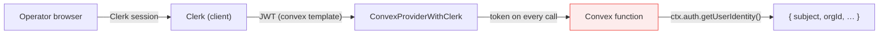
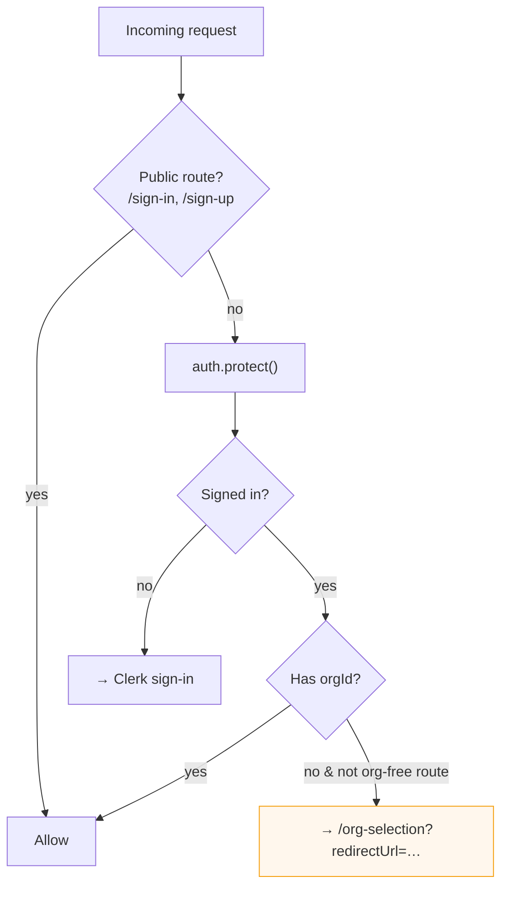
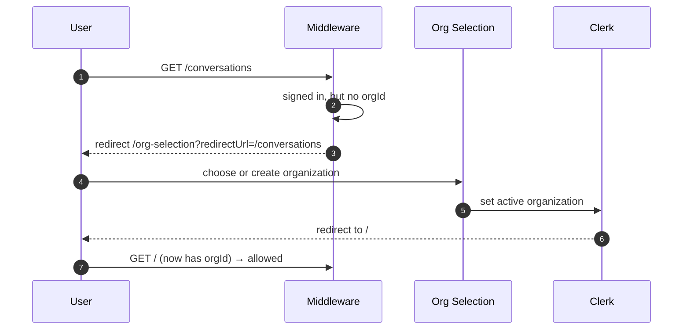
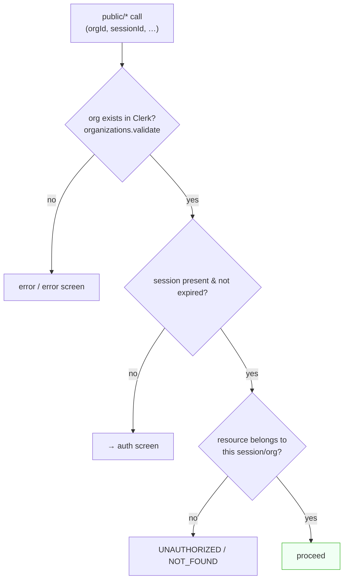
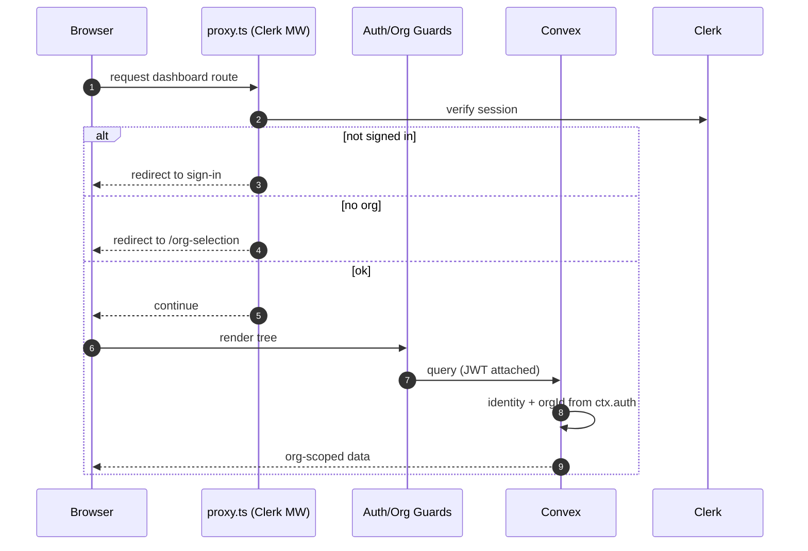

# Authentication & Multi‑Tenancy

Echo uses **Clerk** for authentication and **organizations** for tenancy, and bridges Clerk into **Convex** so every backend function can trust the caller's identity. This doc explains the full chain — from a browser request, through middleware and React guards, to an organization‑scoped database query.

---

## Table of Contents

- [The two identities](#the-two-identities)
- [The Clerk ↔ Convex bridge](#the-clerk--convex-bridge)
- [Route protection (middleware)](#route-protection-middleware)
- [React guards](#react-guards)
- [Organization selection flow](#organization-selection-flow)
- [How the backend enforces tenancy](#how-the-backend-enforces-tenancy)
- [The widget: anonymous but safe](#the-widget-anonymous-but-safe)
- [End‑to‑end sequence](#end-to-end-sequence)

---

## The two identities

Echo has **two distinct notions of "who is calling"**:

| Identity            | Who                             | Established by                                                  | Used by                                      |
| ------------------- | ------------------------------- | --------------------------------------------------------------- | -------------------------------------------- |
| **Operator**        | A logged‑in support team member | Clerk sign‑in + organization membership                         | `apps/web` dashboard → `private/*` functions |
| **Contact session** | An anonymous website visitor    | The widget's auth screen (name + email) → `contactSessions` row | `apps/widget` → `public/*` functions         |

Operators are authenticated (Clerk JWT). Visitors are **not** authenticated — they're identified by a contact‑session ID stored in `localStorage` and validated on every call.

---

## The Clerk ↔ Convex bridge

Convex needs to trust Clerk's JWTs. Two pieces make that work:

**1. `auth.config.ts`** registers Clerk as a JWT provider:

```ts
// packages/backend/convex/auth.config.ts
export default {
  providers: [
    {
      domain: process.env.CLERK_JWT_ISSUER_DOMAIN,
      applicationID: "convex",
    },
  ],
}
```

This requires a Clerk **JWT template named `convex`**, and `CLERK_JWT_ISSUER_DOMAIN` set in the Convex environment.

**2. `ConvexProviderWithClerk`** (in `apps/web/components/theme-provider.tsx`) forwards the Clerk token to Convex on every request:

```tsx
const convex = new ConvexReactClient(process.env.NEXT_PUBLIC_CONVEX_URL)

<ConvexProviderWithClerk client={convex} useAuth={useAuth}>
  {children}
</ConvexProviderWithClerk>
```

Now, inside any Convex function, `await ctx.auth.getUserIdentity()` returns the verified Clerk identity (including `orgId`), or `null`.



---

## Route protection (middleware)

`apps/web/proxy.ts` runs Clerk middleware on the dashboard. It enforces two rules:

1. **Everything except `/sign-in` and `/sign-up` requires authentication** (`auth.protect()`).
2. **A signed‑in user without an active organization** is redirected to `/org-selection` (except on already‑org‑free routes), preserving the original URL as `redirectUrl`.



The matcher skips Next.js internals and static assets, and always runs for API routes.

---

## React guards

Inside the dashboard tree, two guards provide a second layer (and the loading/sign‑in UI):

| Guard                   | Responsibility                                                                                                              |
| ----------------------- | --------------------------------------------------------------------------------------------------------------------------- |
| **`AuthGuard`**         | Uses Convex's `Authenticated` / `Unauthenticated` / `AuthLoading` to render the app, a sign‑in view, or a loading state     |
| **`OrganizationGuard`** | Uses Clerk's `useOrganization()`; if there's no active organization, renders the org‑selection view instead of the children |

`DashboardLayout` composes them:

```
AuthGuard
 └─ OrganizationGuard
     └─ Jotai <Provider>
         └─ SidebarProvider
             └─ DashboardSidebar + <main>{children}</main>
```

So the dashboard content only ever renders for an authenticated user _with_ an active organization.

---

## Organization selection flow

If a user is signed in but hasn't chosen an organization, they land on `OrgSelectionView`, which renders Clerk's `<OrganizationList>` (create or pick an org, personal accounts hidden, invitations auto‑skipped). On create/select, they return to `/`.



---

## How the backend enforces tenancy

Every `private/*` function follows the same guard pattern:

```ts
const identity = await ctx.auth.getUserIdentity()
if (identity === null) throw new ConvexError({ code: "UNAUTHORIZED", ... })

const orgId = identity.orgId as string
if (!orgId) throw new ConvexError({ code: "UNAUTHORIZED", ... })

// …then every query filters WHERE organizationId === orgId,
// and cross-org access (e.g. a conversation from another org) is rejected.
```

For example, `private/conversations.getOne` fetches the conversation, then verifies `conversation.organizationId === orgId` before returning it — a mismatch throws `UNAUTHORIZED`.

---

## The widget: anonymous but safe

The widget is **not** authenticated. It carries only an `organizationId` (from its iframe URL) and a contact‑session ID (from `localStorage`). Safety comes from `public/*` functions **validating everything on every call**:



- **Org validation** — `public/organizations.validate` calls Clerk to confirm the org exists.
- **Session validation** — `public/contactSessions.validate` checks presence + expiry.
- **Ownership** — e.g. `public/conversations.getOne` verifies the conversation's `contactSessionId` matches the caller's session.

Because the widget never receives anything it shouldn't (e.g. `secrets.getVapiSecrets` returns _only_ the public key), an anonymous caller can't escalate access.

---

## End‑to‑end sequence



---

**Next:** [Data Model](data-model.md) · [Backend API Reference](backend-api.md) · [Billing & Subscriptions](billing.md)
