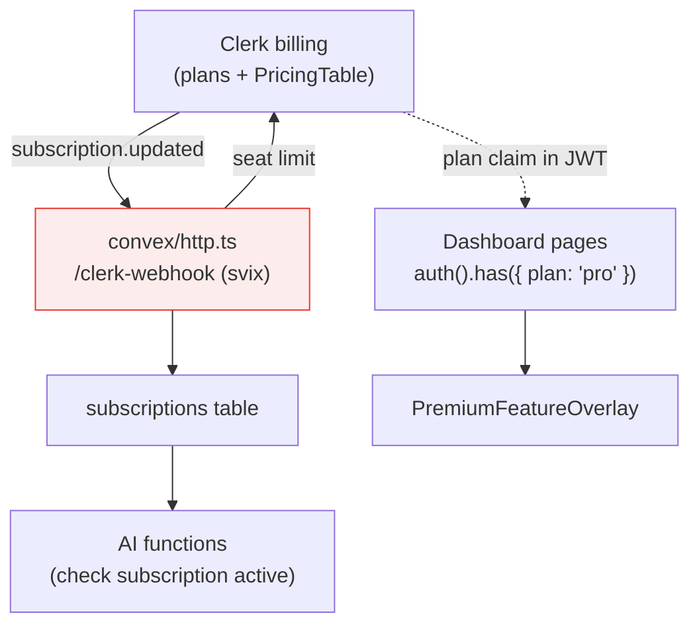
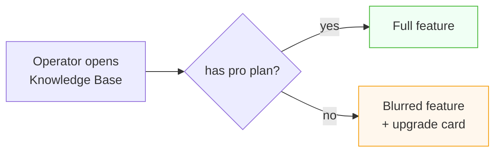
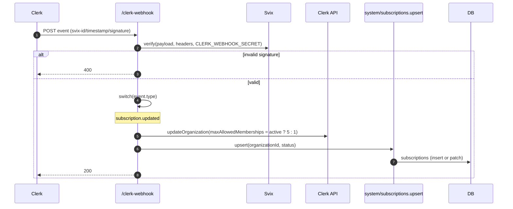
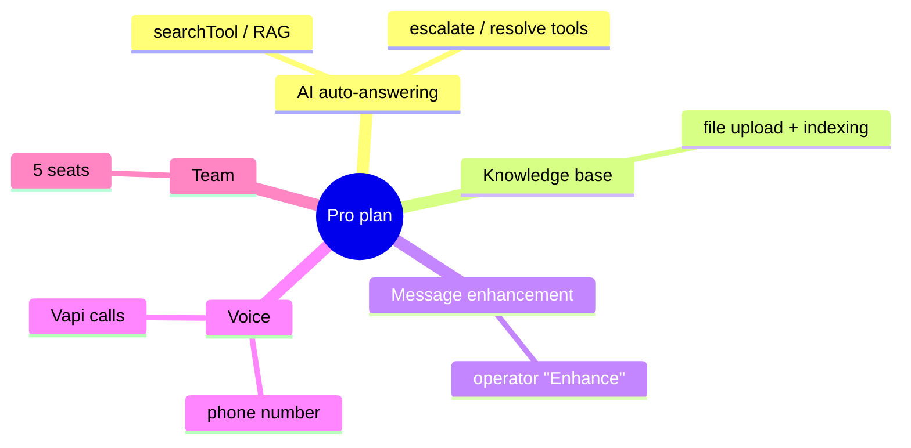

# Billing & Subscriptions

Echo monetizes with a **Free / Pro** model managed by **Clerk billing**. A signature‑verified webhook keeps Convex in sync, and Pro‑tier features are gated both at the page level (UI) and the function level (enforcement).

---

## Table of Contents

- [The model](#the-model)
- [Pieces involved](#pieces-involved)
- [The pricing page](#the-pricing-page)
- [Page‑level gating](#page-level-gating)
- [The subscription webhook](#the-subscription-webhook)
- [Function‑level enforcement](#function-level-enforcement)
- [What Pro unlocks](#what-pro-unlocks)

---

## The model

| Plan     | Seats | AI features                                                     |
| -------- | ----- | --------------------------------------------------------------- |
| **Free** | 1     | Widget + dashboard + human replies only                         |
| **Pro**  | 5     | + AI auto‑answering, knowledge base, message enhancement, voice |

Plans are defined in Clerk; Echo mirrors the org's subscription **status** into its own `subscriptions` table and gates features on `status === "active"`.

---

## Pieces involved



Note the **two independent signals**:

1. **Clerk plan claim** (`has({ plan: "pro" })`) — used for **UI gating** on server components.
2. **`subscriptions.status`** in Convex (set by the webhook) — used for **backend enforcement** of AI actions.

---

## The pricing page

`apps/web/app/(dashboard)/billing/page.tsx` renders `BillingView` → `PricingTable`, which wraps Clerk's `<PricingTable for="organization">` with themed `appearance.elements` to match the dashboard.

> Uses the current Clerk API: `for="organization"` (the older boolean `forOrganizations` prop was removed in the installed SDK). See the CHANGELOG for the migration note.

---

## Page‑level gating

Three dashboard pages are Pro‑only. Each is an **async Server Component** that checks the plan and renders a `PremiumFeatureOverlay` upsell when the org isn't on Pro:

```tsx
// customization / files / plugins-vapi pages
const { has } = await auth()
const hasProPlan = has({ plan: "pro" })

if (!hasProPlan) {
  return (
    <PremiumFeatureOverlay>
      <FeatureView /> {/* blurred behind the overlay */}
    </PremiumFeatureOverlay>
  )
}
return <FeatureView />
```

`PremiumFeatureOverlay` blurs and disables the underlying view, dims the background, and centers an upgrade card listing the six Pro features with a **View Plans** button linking to `/billing`.



> `<Protect>` (an older Clerk component) is **not** used — it was removed from the installed SDK. Gating uses the server‑side `auth().has()` check instead.

---

## The subscription webhook

Clerk sends billing events to `POST /clerk-webhook` ([`convex/http.ts`](../packages/backend/convex/http.ts)), an HTTP action that **verifies the `svix` signature** before trusting anything.



On `subscription.updated`, the handler:

1. Reads `organizationId` from `subscription.payer.organization_id` (400 if missing).
2. Sets the org's **seat limit** in Clerk (`maxAllowedMemberships`: 5 active / 1 otherwise).
3. Upserts the org's status into `subscriptions`.

Requires `CLERK_SECRET_KEY` and `CLERK_WEBHOOK_SECRET` in the Convex environment, and the webhook endpoint registered in Clerk pointing at `<convex-site>/clerk-webhook`.

---

## Function‑level enforcement

UI gating alone isn't enough — the backend independently enforces the subscription for AI actions, reading the mirrored `subscriptions` status:

| Function                           | Enforcement                                                                                   |
| ---------------------------------- | --------------------------------------------------------------------------------------------- |
| `public/messages.create`           | AI agent runs **only** if `subscription.status === "active"` (and conversation is unresolved) |
| `private/messages.enhanceResponse` | Throws `BAD_REQUEST` "Missing subscription" if not active                                     |
| `private/files.addFile`            | Throws `BAD_REQUEST` "Missing subscription" if not active                                     |

So even if a client bypassed the UI, the AI features remain protected server‑side.

---

## What Pro unlocks



When a subscription lapses, the widget and human‑reply workflow keep working; only the AI capabilities pause until it's active again.

---

**Next:** [AI Agent & RAG](ai-agent.md) · [Authentication & Multi‑Tenancy](authentication.md) · [Backend API Reference](backend-api.md)
