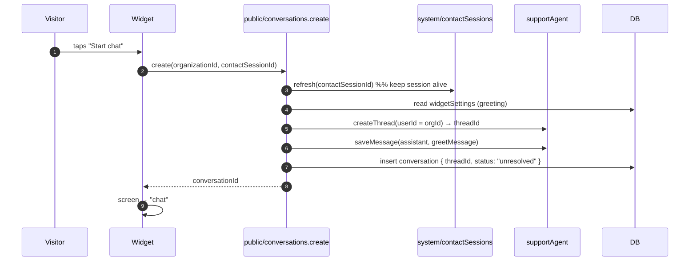
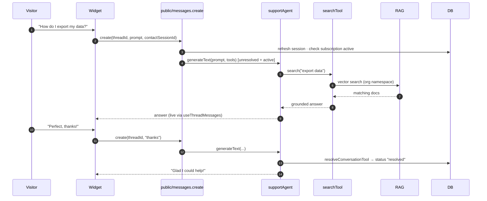
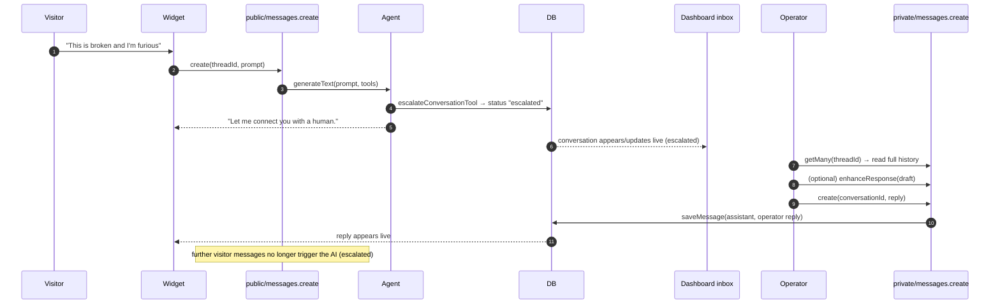
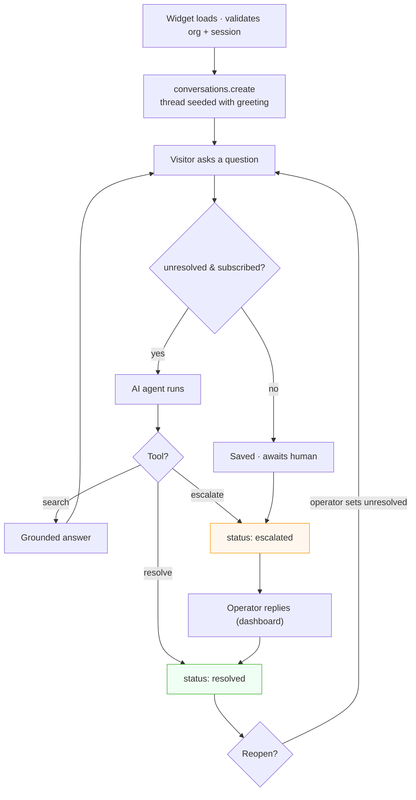
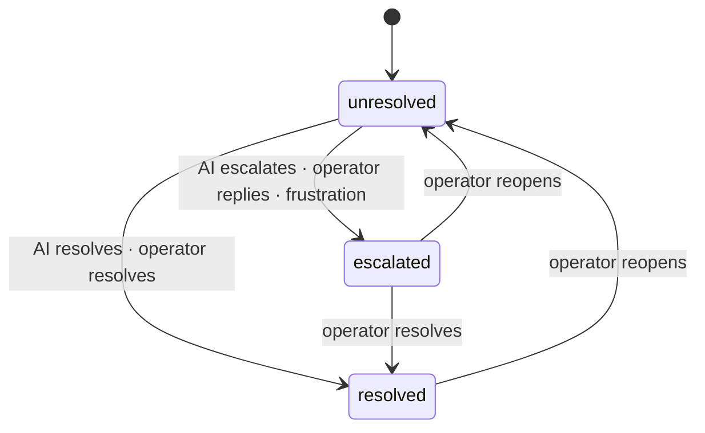

# Conversation Flows

This doc traces conversations end to end — from a visitor's first message through AI answering, escalation, human takeover, and resolution — showing exactly which functions run at each step.

> See also: [AI Agent & RAG](ai-agent.md) for the agent internals, [Widget & Embed](widget.md) for the visitor UI, and [Backend API Reference](backend-api.md) for function signatures.

---

## Table of Contents

- [Actors & surfaces](#actors--surfaces)
- [Starting a conversation](#starting-a-conversation)
- [The happy path: AI resolves it](#the-happy-path-ai-resolves-it)
- [Escalation & human takeover](#escalation--human-takeover)
- [The full lifecycle](#the-full-lifecycle)
- [Status transitions](#status-transitions)
- [Where each message comes from](#where-each-message-comes-from)

---

## Actors & surfaces

| Actor        | Surface         | Talks to      |
| ------------ | --------------- | ------------- |
| **Visitor**  | Widget (iframe) | `public/*`    |
| **AI agent** | Convex backend  | `system/ai/*` |
| **Operator** | Dashboard       | `private/*`   |

A **conversation** ties them together: it has a `threadId` (agent messages), a `contactSessionId` (the visitor), an `organizationId`, and a `status`.

---

## Starting a conversation

From the widget's selection screen, "Start chat" creates a conversation. The agent thread is created and seeded with the org's configured greeting **before** the conversation row is inserted.

The greeting defaults to _"Hello, how can I help you today?"_ if the org hasn't customized `widgetSettings.greetMessage`.

---

## The happy path: AI resolves it

Most conversations never involve a human. The visitor asks, the AI searches the knowledge base, answers, and eventually resolves.

---

## Escalation & human takeover

When the AI can't help, the customer is frustrated, or they ask for a person, the conversation is escalated and an operator takes over — in the same thread, with full context.

Two things make takeover seamless:

1. **The dashboard inbox is a live Convex query** — an escalated conversation appears without a refresh.
2. **Once escalated, `public/messages.create` won't run the AI** — the human owns the conversation. (An operator reply on an _unresolved_ conversation also auto‑escalates it, via `private/messages.create`.)

---

## The full lifecycle

Putting it together — from embed load to resolution, across both AI and human paths:

---

## Status transitions

| Status       | AI auto‑responds?  | Meaning                                          |
| ------------ | ------------------ | ------------------------------------------------ |
| `unresolved` | ✅ (if subscribed) | New/ongoing; AI is handling it                   |
| `escalated`  | ❌                 | A human has been pulled in                       |
| `resolved`   | ❌                 | Closed; input disabled in the operator chat view |

The operator's `ConversationStatusButton` cycles `unresolved → escalated → resolved → unresolved`.

---

## Where each message comes from

A single thread can contain messages from three sources — all stored as agent messages, so both chat UIs render them uniformly:

| Message author                   | Written by                                                            | Role in thread                 |
| -------------------------------- | --------------------------------------------------------------------- | ------------------------------ |
| **Greeting**                     | `public/conversations.create` (via `saveMessage`)                     | `assistant`                    |
| **AI answer**                    | `searchTool` / `supportAgent.generateText`                            | `assistant`                    |
| **Escalation/resolution notice** | `escalateConversationTool` / `resolveConversationTool`                | `assistant`                    |
| **Visitor message**              | `public/messages.create` (agent `generateText` records the user turn) | `user`                         |
| **Operator reply**               | `private/messages.create` (via `saveMessage`)                         | `assistant` (with `agentName`) |

> In the **dashboard** chat view, roles are intentionally inverted for display — the operator sees visitor messages on one side and assistant/operator messages on the other, from the _operator's_ perspective.

---

**Next:** [Widget & Embed](widget.md) · [AI Agent & RAG](ai-agent.md) · [Backend API Reference](backend-api.md)
