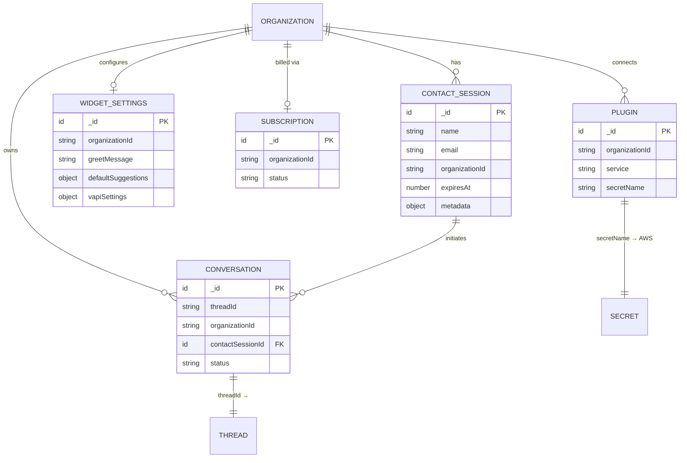
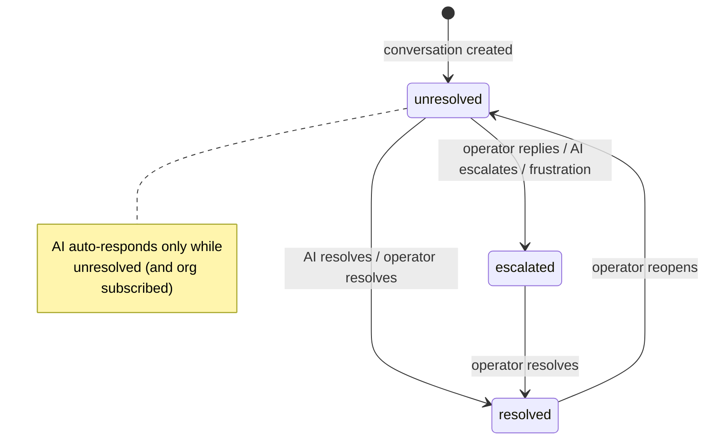

# Data Model

Echo's system of record is a **Convex** database defined in [`packages/backend/convex/schema.ts`](../packages/backend/convex/schema.ts). Every business table is partitioned by `organizationId` and indexed for its access patterns. AI threads, messages, and embeddings are managed by the `@convex-dev/agent` and `@convex-dev/rag` Convex components.

---

## Entity relationship diagram

> `ORGANIZATION`, `THREAD`, and `SECRET` are **external** entities: organizations live in Clerk, threads/messages live in the agent component, and secrets live in AWS Secrets Manager. Echo references them by ID/name.

---

## Tables

### `contactSessions`

A website visitor's identity and environment, captured when they first authenticate to the widget. Sessions carry a **24‑hour TTL** (`SESSION_DURATION_MS`) that **auto‑refreshes** while the visitor is active (see `system/contactSessions.refresh`).

| Field            | Type      | Notes                                  |
| ---------------- | --------- | -------------------------------------- |
| `name`           | `string`  | Provided in the widget auth screen     |
| `email`          | `string`  | Provided in the widget auth screen     |
| `organizationId` | `string`  | Owning Clerk organization              |
| `expiresAt`      | `number`  | Epoch ms; refreshed when < 4h remain   |
| `metadata`       | `object?` | Browser/device/locale snapshot (below) |

**`metadata`** (all optional): `userAgent`, `language`, `languages`, `platform`, `vendor`, `screenResolution`, `viewportSize`, `timezone`, `timezoneOffset`, `cookieEnabled`, `referrer`, `currentUrl`.

**Indexes:** `by_organization_id`, `by_expires_at`.

### `conversations`

A single support thread. Links a contact session to an agent thread and tracks resolution.

| Field              | Type                                        | Notes                                                     |
| ------------------ | ------------------------------------------- | --------------------------------------------------------- |
| `threadId`         | `string`                                    | ID of the `@convex-dev/agent` thread holding the messages |
| `organizationId`   | `string`                                    | Owning organization                                       |
| `contactSessionId` | `id("contactSessions")`                     | The visitor                                               |
| `status`           | `"unresolved" \| "escalated" \| "resolved"` | Drives AI behavior and inbox filtering                    |

**Indexes:** `by_organization_id`, `by_contact_session_id`, `by_thread_id`, `by_status_and_organization_id`.

**Status semantics:**

### `widgetSettings`

Per‑organization widget configuration, edited in the dashboard's Customization page and consumed live by the widget.

| Field                | Type     | Notes                                            |
| -------------------- | -------- | ------------------------------------------------ |
| `organizationId`     | `string` | One row per org                                  |
| `greetMessage`       | `string` | Seeded as the first assistant message            |
| `defaultSuggestions` | `object` | `suggestion1/2/3` (optional) — quick‑reply chips |
| `vapiSettings`       | `object` | `assistantId`, `phoneNumber` (optional)          |

**Index:** `by_organization_id`.

### `subscriptions`

A mirror of the organization's Clerk subscription status, kept in sync by the billing webhook. Gates Pro‑tier AI features.

| Field            | Type     | Notes                                                          |
| ---------------- | -------- | -------------------------------------------------------------- |
| `organizationId` | `string` | One row per org                                                |
| `status`         | `string` | `"active"` unlocks AI answering, enhancement, and file uploads |

**Index:** `by_organization_id`.

### `plugins`

Records that an organization has connected a third‑party service. The actual credentials live in AWS Secrets Manager; this row only stores the secret's _name_.

| Field            | Type     | Notes                                      |
| ---------------- | -------- | ------------------------------------------ |
| `organizationId` | `string` | Owning org                                 |
| `service`        | `"vapi"` | Union — currently Vapi only                |
| `secretName`     | `string` | `tenant/{organizationId}/{service}` in AWS |

**Indexes:** `by_organization_id`, `by_organization_id_and_service`.

### `users`

A scaffold table (`{ name }`) retained from the starter. Not part of the support workflow.

---

## Component‑managed data (not in `schema.ts`)

| Data                          | Managed by          | Keyed by                                 | Notes                                                                                                  |
| ----------------------------- | ------------------- | ---------------------------------------- | ------------------------------------------------------------------------------------------------------ |
| **Agent threads & messages**  | `@convex-dev/agent` | `threadId`                               | One thread per conversation; holds the full message history the chat UIs paginate                      |
| **Knowledge‑base embeddings** | `@convex-dev/rag`   | per‑org **namespace** (`organizationId`) | Documents are chunked, embedded (`gemini-embedding-001`), and searched within the org's namespace only |
| **Encrypted credentials**     | AWS Secrets Manager | `tenant/{org}/{service}`                 | e.g. Vapi public/private keys                                                                          |

Both Convex components are registered in [`convex.config.ts`](../packages/backend/convex/convex.config.ts) via `app.use(agent)` and `app.use(rag)`.

---

## Multi‑tenancy invariant

> **Every business row carries `organizationId`, and every function filters by it.**

- `public/*` functions derive the org from the widget's `organizationId` argument, then validate it (org exists in Clerk, session belongs to it, conversation belongs to the session).
- `private/*` functions derive the org from the **authenticated Clerk identity** (`identity.orgId`) and reject mismatches with `UNAUTHORIZED`.
- RAG search is scoped to the org's namespace, so one tenant can never retrieve another's documents.

See [authentication.md](authentication.md) for how the org is established and enforced.

---

**Next:** [Authentication & Multi‑Tenancy](authentication.md) · [Backend API Reference](backend-api.md)
