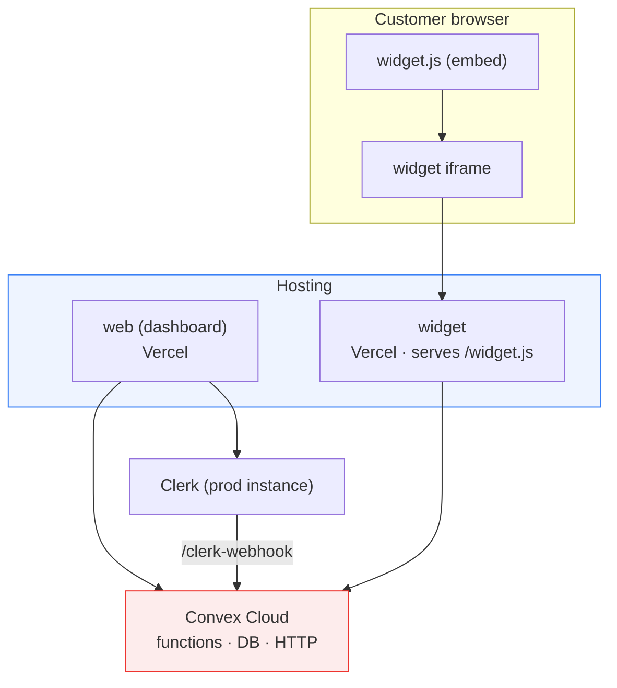
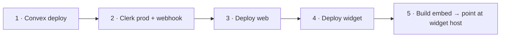

# Deployment Guide

Echo has **four deployable units**. This guide covers shipping each to production and wiring them together.

> Local setup first: [setup.md](setup.md). Architecture context: [architecture.md](architecture.md).

---

## Table of Contents

- [Topology](#topology)
- [Order of operations](#order-of-operations)
- [1. Deploy Convex](#1-deploy-convex)
- [2. Configure Clerk for production](#2-configure-clerk-for-production)
- [3. Deploy the dashboard (web)](#3-deploy-the-dashboard-web)
- [4. Deploy the widget](#4-deploy-the-widget)
- [5. Build & host the embed loader](#5-build--host-the-embed-loader)
- [Production checklist](#production-checklist)

---

## Topology



| Unit        | Host                        | Notes                                                    |
| ----------- | --------------------------- | -------------------------------------------------------- |
| **backend** | Convex Cloud                | `npx convex deploy`; all secrets set in Convex           |
| **web**     | Vercel (root `apps/web`)    | Needs `NEXT_PUBLIC_*` + Clerk keys                       |
| **widget**  | Vercel (root `apps/widget`) | Serves `/widget.js`; needs `NEXT_PUBLIC_CONVEX_URL`      |
| **embed**   | Widget's `public/` or a CDN | Built with `VITE_WIDGET_URL` pointing at the widget host |

---

## Order of operations



Deploy Convex first (everything depends on it), then Clerk (the dashboard and webhook depend on it), then the two Next apps, then the embed loader (which must know the widget's public URL).

---

## 1. Deploy Convex

```bash
cd packages/backend
npx convex deploy
```

Then, in the **production** Convex deployment's environment, set:

- `CLERK_JWT_ISSUER_DOMAIN`
- `CLERK_SECRET_KEY`
- `CLERK_WEBHOOK_SECRET`
- `GOOGLE_GENERATIVE_AI_API_KEY`
- `AWS_REGION`, `AWS_ACCESS_KEY_ID`, `AWS_SECRET_ACCESS_KEY` (if using voice)

Note the production Convex URL (`https://<name>.convex.cloud`) and the Convex **site** URL (`https://<name>.convex.site`) — the latter is where HTTP actions (the webhook) live.

---

## 2. Configure Clerk for production

1. Switch to (or create) your Clerk **production instance**; note the production keys.
2. Recreate the **`convex` JWT template** in production and set its Issuer as `CLERK_JWT_ISSUER_DOMAIN` in Convex.
3. Ensure **Organizations** and **Billing** (with the `pro` plan) are enabled.
4. Create a **webhook** subscribed to `subscription.updated`, pointing at:

   ```
   https://<your-convex-deployment>.convex.site/clerk-webhook
   ```

   Set its signing secret as `CLERK_WEBHOOK_SECRET` in Convex.

---

## 3. Deploy the dashboard (web)

On Vercel (or any Next.js host), set **Root Directory** to `apps/web` and configure:

| Variable                            | Value                        |
| ----------------------------------- | ---------------------------- |
| `NEXT_PUBLIC_CONVEX_URL`            | Production Convex URL        |
| `NEXT_PUBLIC_CLERK_PUBLISHABLE_KEY` | Production `pk_live_…`       |
| `CLERK_SECRET_KEY`                  | Production `sk_live_…`       |
| `SENTRY_AUTH_TOKEN`                 | _(optional)_ for source maps |

The app auto‑detects `CI` for Sentry source‑map upload.

---

## 4. Deploy the widget

Set **Root Directory** to `apps/widget` and configure:

| Variable                 | Value                 |
| ------------------------ | --------------------- |
| `NEXT_PUBLIC_CONVEX_URL` | Production Convex URL |

The widget is what the embed iframe loads, and it also serves the loader at `/widget.js`. Note its public origin (e.g. `https://widget.yourdomain.com`) — the embed loader and integration snippets must point here.

---

## 5. Build & host the embed loader

The embed loader is a static IIFE bundle. Build it with the widget's public URL:

```bash
cd apps/embed
VITE_WIDGET_URL=https://widget.yourdomain.com pnpm build
# → apps/embed/dist/widget.iife.js
```

Host that file where customers will reference it — commonly copied into `apps/widget/public/widget.js` so it's served from the widget origin at `/widget.js`.

> **Important — remove `localhost`:** the shipped defaults reference `http://localhost:3001`. Before release, update:
>
> - `EMBED_CONFIG.WIDGET_URL` (via `VITE_WIDGET_URL` at build time), and
> - the `HTML_SCRIPT` / `REACT_SCRIPT` / `NEXTJS_SCRIPT` / `JAVASCRIPT_SCRIPT` constants in `apps/web/modules/integrations/constants/index.ts` (the copy‑paste snippets shown to customers).

---

## Production checklist

- [ ] Convex deployed; all env vars set in the **production** deployment
- [ ] Clerk production instance: `convex` JWT template, Organizations, Billing (`pro` plan)
- [ ] Clerk webhook → `https://<convex-site>/clerk-webhook`, secret in Convex
- [ ] `web` deployed with production Convex + Clerk keys
- [ ] `widget` deployed with production Convex URL; note its origin
- [ ] `embed` built with `VITE_WIDGET_URL` = widget origin
- [ ] Integration snippet constants updated to the production widget host
- [ ] AWS IAM user configured (if voice enabled)
- [ ] Sentry DSN/token configured (if monitoring enabled)
- [ ] Smoke test: open the widget with a real org ID; send a message; confirm it appears live in the dashboard inbox

---

**Next:** [Embedding the Widget](embedding.md) · [Billing & Subscriptions](billing.md)
