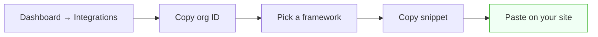
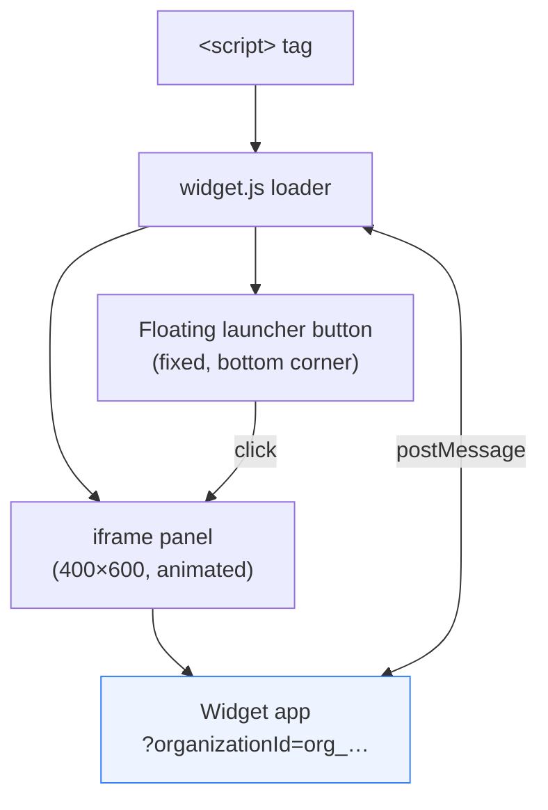

# Embedding the Widget

How a customer puts Echo on their website. This is the end‑user integration guide — the same content the dashboard's **Integrations** page generates snippets for.

> Internals of the loader and widget are in [widget.md](widget.md).

---

## Table of Contents

- [The one‑tag install](#the-one-tag-install)
- [Finding your organization ID](#finding-your-organization-id)
- [Framework snippets](#framework-snippets)
- [Configuration attributes](#configuration-attributes)
- [Programmatic control](#programmatic-control)
- [How it renders](#how-it-renders)
- [FAQ](#faq)

---

## The one‑tag install

Add a single `<script>` tag to any page. The loader injects a floating launcher and an organization‑scoped iframe.

```html
<script
  src="https://YOUR_WIDGET_HOST/widget.js"
  data-organization-id="org_XXXXXXXXXXXXXXXXXXXX"
  data-position="bottom-right"
></script>
```

Replace `YOUR_WIDGET_HOST` with your Echo widget origin and `data-organization-id` with your org ID.

---

## Finding your organization ID

In the dashboard, open **Integrations**. Your organization ID (`org_…`) is shown with a copy button, alongside ready‑to‑paste snippets for each framework.



---

## Framework snippets

All snippets are the same tag, placed idiomatically per framework.

**HTML** — before `</body>`:

```html
<script
  src="https://YOUR_WIDGET_HOST/widget.js"
  data-organization-id="org_XXXX"
></script>
```

**Next.js** — using `next/script`:

```tsx
import Script from "next/script"

export default function Layout({ children }) {
  return (
    <>
      {children}
      <Script
        src="https://YOUR_WIDGET_HOST/widget.js"
        data-organization-id="org_XXXX"
        strategy="afterInteractive"
      />
    </>
  )
}
```

**React** — inject on mount:

```tsx
import { useEffect } from "react"

export function EchoWidget() {
  useEffect(() => {
    const s = document.createElement("script")
    s.src = "https://YOUR_WIDGET_HOST/widget.js"
    s.dataset.organizationId = "org_XXXX"
    document.body.appendChild(s)
    return () => {
      s.remove()
      window.EchoWidget?.destroy()
    }
  }, [])
  return null
}
```

**JavaScript** — programmatic injection:

```js
const s = document.createElement("script")
s.src = "https://YOUR_WIDGET_HOST/widget.js"
s.setAttribute("data-organization-id", "org_XXXX")
document.body.appendChild(s)
```

> The dashboard currently generates these with `http://localhost:3001/widget.js`; in production this becomes your widget host (see [deployment.md](deployment.md)).

---

## Configuration attributes

| Attribute              | Values                        | Default          | Purpose                                |
| ---------------------- | ----------------------------- | ---------------- | -------------------------------------- |
| `data-organization-id` | `org_…`                       | — (**required**) | Scopes the widget to your organization |
| `data-position`        | `bottom-right`, `bottom-left` | `bottom-right`   | Launcher corner                        |

If `data-organization-id` is missing, the loader logs an error and does nothing.

---

## Programmatic control

The loader exposes a global once loaded:

```js
// Re-initialize with new configuration (destroys and re-renders)
window.EchoWidget.init({
  organizationId: "org_XXXX",
  position: "bottom-left",
})

window.EchoWidget.show() // open the chat panel
window.EchoWidget.hide() // close it
window.EchoWidget.destroy() // remove the widget entirely
```

Useful for SPAs (re‑init on tenant switch), "Contact us" buttons (`show()`), or route changes (`destroy()` on unmount).

---

## How it renders



- The launcher is a 60×60 circular button, fixed 20px from the bottom and chosen corner, `z-index: 999999`.
- The panel is a 400×600 iframe (clamped to the viewport), with a fade/translate open animation.
- The iframe is granted `microphone; clipboard-read; clipboard-write` for voice.
- The widget can ask the host to `close` or `resize` via `postMessage`.

---

## FAQ

**Does it slow down my site?**
The loader is a tiny, dependency‑free script and renders the widget in an isolated iframe, so it won't interfere with your page's styles or JavaScript.

**Can I control when it appears?**
Yes — omit auto‑behaviors by controlling it through `window.EchoWidget` (`show`/`hide`/`destroy`).

**Multiple organizations on one page?**
The widget scopes to a single `organizationId`; call `EchoWidget.init({ organizationId })` to switch.

**Does voice need extra setup on my site?**
No — voice works inside the iframe (which already requests microphone permission). Voice availability depends on your Echo plan and Vapi configuration, not your website.

---

**Next:** [Widget & Embed internals](widget.md) · [Deployment Guide](deployment.md)
