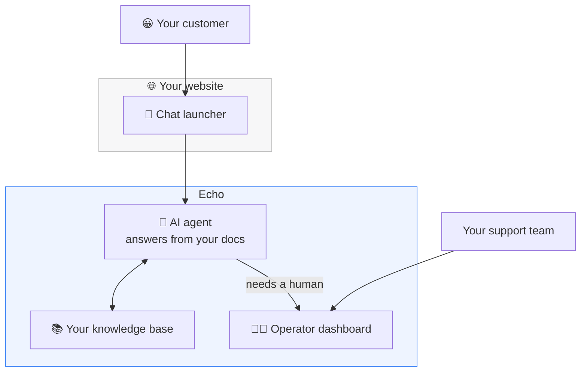
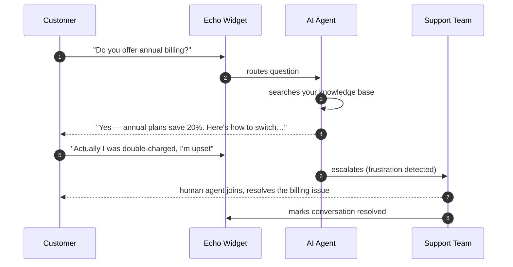
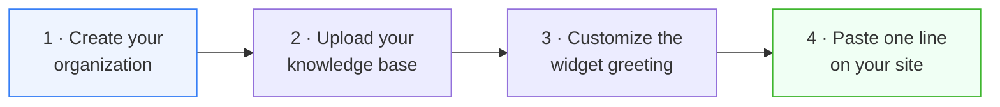

# Echo — Product Overview

**AI‑powered customer support that actually knows your product.**

_A guide for founders, support leaders, buyers, and partners._

---

## Table of Contents

- [The one‑sentence pitch](#the-one-sentence-pitch)
- [The problem](#the-problem)
- [What Echo is](#what-echo-is)
- [How it works, in plain English](#how-it-works-in-plain-english)
- [What your customers experience](#what-your-customers-experience)
- [What your support team experiences](#what-your-support-team-experiences)
- [Core capabilities](#core-capabilities)
- [Why Echo is different](#why-echo-is-different)
- [A day in the life](#a-day-in-the-life)
- [Setup in four steps](#setup-in-four-steps)
- [Plans & what's included](#plans--whats-included)
- [Security & data handling](#security--data-handling)
- [Frequently asked questions](#frequently-asked-questions)
- [Glossary](#glossary)

---

## The one‑sentence pitch

> **Echo puts a 24/7 AI support agent on your website — one that answers from _your_ documentation, talks over chat or voice, and hands off to a human the moment it should — all installed with a single line of code.**

---

## The problem

Every growing company hits the same wall with customer support:

- **The same questions, over and over.** "How do I reset my password?" "What's your refund policy?" "How much is the Pro plan?" Your team answers these hundreds of times a week.
- **Support doesn't sleep, but your team does.** Customers in other time zones wait hours for a reply.
- **Generic chatbots make things worse.** They hallucinate policies you don't have, frustrate customers, and erode trust.
- **Hiring doesn't scale linearly.** Every new customer segment, language, or channel means more headcount.

You want to deflect the repetitive questions automatically **without** giving customers a worse experience — and keep humans in the loop for everything that actually needs them.

---

## What Echo is

Echo is a **hosted, multi‑tenant customer‑support platform** with three parts working together:

1. **An embeddable widget** — a chat (and voice) launcher that lives on your website. One line of code installs it.
2. **An AI support agent** — it answers questions using **your** knowledge base (your docs, FAQs, policies), not the open internet. If it doesn't know, it says so and offers a human.
3. **An operator dashboard** — where your support team sees every conversation live, jumps in when needed, and manages the knowledge base, branding, billing, and integrations.

---

## How it works, in plain English

1. **You upload your knowledge.** PDFs, text files, FAQs, policy docs — whatever your team uses to answer questions. Echo reads and indexes them.
2. **You paste one line of code** on your website. A chat button appears in the corner.
3. **A customer asks a question.** The AI agent searches your knowledge base, finds the relevant answer, and replies in a natural, conversational way — citing only what's actually in your docs.
4. **If the AI can't help** — the question is out of scope, the customer is frustrated, or they simply ask for a person — it **escalates**. The conversation lands in your dashboard for a human to take over.
5. **Your team replies** from the dashboard, with an **"Enhance"** button that instantly polishes a rough draft into a professional response.
6. **When the issue is solved**, the conversation is marked resolved and closed.

The customer never sees the machinery — they just get fast, accurate help.

---

## What your customers experience

- **Instant answers, any hour.** No "we'll get back to you in 24 hours."
- **Accurate answers.** Because the AI only speaks from your uploaded knowledge, it won't invent a refund policy you don't offer.
- **A graceful path to a human.** No dead‑ends. If the AI can't help, a real person steps in seamlessly — same conversation, no repeating themselves.
- **Chat _or_ voice.** Customers can type, or start a live voice call with an AI voice agent, or tap to call a real number — whatever suits them.
- **A polished, on‑brand widget.** A greeting message and quick‑reply suggestions you control.

---

## What your support team experiences

- **A single, live inbox** of every conversation across your site, filterable by status (needs attention, escalated, resolved).
- **Full context on every visitor** — their name and email, plus device, browser, operating system, and location, so agents don't start from zero.
- **AI drafting assistance** — write a quick note, click **Enhance**, and Echo rewrites it into a clear, professional reply.
- **The AI does the first pass.** Agents spend their time on the conversations that genuinely need a human, not on password resets.
- **Knowledge base management** — upload, browse, and remove documents; the AI's answers improve the moment you add content.

---

## Core capabilities

| Capability                | What it means for you                                                         |
| ------------------------- | ----------------------------------------------------------------------------- |
| **Grounded AI answers**   | The agent answers from your documents only — no hallucinated policies.        |
| **Automatic escalation**  | Frustration or an explicit request for a human instantly routes to your team. |
| **Live human takeover**   | Operators reply in the same thread; the AI steps back automatically.          |
| **Knowledge base (RAG)**  | Upload PDFs, CSVs, and text; Echo indexes them for the AI to search.          |
| **Voice support**         | Live AI voice calls in the widget, plus a tap‑to‑call phone option.           |
| **Real‑time dashboard**   | Conversations, statuses, and messages update instantly.                       |
| **Visitor intelligence**  | Device, browser, OS, timezone, and country for every conversation.            |
| **One‑line embedding**    | Install on any site — HTML, React, Next.js, or plain JavaScript.              |
| **Multi‑tenant & secure** | Each organization's data is fully isolated; secrets are encrypted.            |
| **Usage‑based plans**     | Advanced AI features unlock with a Pro subscription.                          |

---

## Why Echo is different

**1. It won't make things up.**
Most AI chatbots are trained on the open internet and will confidently invent answers. Echo uses **retrieval‑augmented generation** — it retrieves passages from _your_ documents first, then answers from those. When it can't find something, it says _"I couldn't find that — would you like a human?"_ instead of guessing.

**2. Humans are first‑class, not an afterthought.**
Escalation and takeover are built into the core flow. The AI knows when to step aside, and your team picks up mid‑conversation with full context.

**3. Chat and voice in one widget.**
The same launcher can open a text chat _or_ a live voice conversation with an AI agent — no separate phone system to buy.

**4. It installs in minutes.**
One `<script>` tag. No SDK integration project, no engineering sprint.

**5. Built for scale from day one.**
True multi‑tenancy, per‑organization data isolation, subscription billing, and real‑time sync are foundational — not bolted on.

---

## A day in the life

Most conversations end at step 4 — deflected, resolved, no human needed. The ones that reach your team are the ones that _should_.

---

## Setup in four steps

1. **Create your organization** and invite your team.
2. **Upload your documents** under Knowledge Base — the AI starts learning immediately.
3. **Customize** the greeting and quick‑reply suggestions (and optionally connect voice).
4. **Copy the embed snippet** from the Integrations page and paste it into your website.

That's it — your AI support agent is live.

---

## Plans & what's included

Echo uses a **Free** and **Pro** model, managed through secure billing.

|                                 | Free | Pro |
| ------------------------------- | ---- | --- |
| Embeddable chat widget          | ✓    | ✓   |
| Operator dashboard & inbox      | ✓    | ✓   |
| Human replies                   | ✓    | ✓   |
| **AI auto‑answers**             | —    | ✓   |
| **Knowledge base (RAG)**        | —    | ✓   |
| **AI "Enhance" reply drafting** | —    | ✓   |
| **Voice AI & phone**            | —    | ✓   |
| **Expanded team seats**         | 1    | 5   |

> Pro‑tier features are enforced in real time: when a subscription is active, AI answering, file uploads, message enhancement, and voice unlock automatically; when it lapses, the widget still works for human‑only support.

---

## Security & data handling

- **Tenant isolation.** Every piece of data — conversations, contacts, documents, settings — is scoped to a single organization and never crosses tenants. Knowledge‑base search is namespaced per organization.
- **Encrypted credentials.** Third‑party keys (e.g. voice provider keys) are stored in **AWS Secrets Manager**, never in the database or the browser. The widget only ever receives a _public_ key.
- **Verified webhooks.** Billing events are cryptographically signature‑verified before they're trusted.
- **Authenticated dashboard.** The operator dashboard is protected by enterprise auth (Clerk) with organization‑level access control.
- **Monitored.** Errors and performance are tracked with Sentry across the stack.

More detail for security teams lives in [`../SECURITY.md`](../SECURITY.md) and [`authentication.md`](authentication.md).

---

## Frequently asked questions

**Will the AI make up answers?**
No. It answers only from the documents you upload. If it can't find an answer, it offers to connect the customer with a human.

**What happens when the AI can't help?**
The conversation is escalated to your dashboard, where a human agent takes over in the same thread — the customer doesn't repeat themselves.

**Do we need engineers to install it?**
No. Installation is a single `<script>` tag. The dashboard generates copy‑paste snippets for common frameworks.

**Can customers talk instead of type?**
Yes — the widget supports live AI voice calls and can also display a tap‑to‑call phone number.

**How does the AI learn our product?**
You upload documents (PDF, CSV, text). Echo extracts and indexes them so the AI can search and cite them. Add a document and answers improve instantly.

**Is our data shared with other companies using Echo?**
No. Data is isolated per organization at every layer, including AI knowledge‑base search.

**What if we stop paying?**
The widget and human‑reply workflow keep working; the advanced AI features (auto‑answering, knowledge base, voice, enhancement) pause until the subscription is active again.

---

## Glossary

| Term                | Meaning                                                                                   |
| ------------------- | ----------------------------------------------------------------------------------------- |
| **Organization**    | Your company's tenant in Echo. All your data lives under it.                              |
| **Widget**          | The chat/voice launcher embedded on your website.                                         |
| **Contact session** | A record of a website visitor (name, email, device info) for the duration of their visit. |
| **Conversation**    | A single support thread between a visitor and Echo (AI and/or human).                     |
| **Knowledge base**  | The documents you upload that the AI answers from.                                        |
| **RAG**             | Retrieval‑Augmented Generation — the AI retrieves your documents before answering.        |
| **Escalation**      | Handing a conversation from the AI to a human operator.                                   |
| **Operator**        | A member of your support team using the dashboard.                                        |

---

**Ready to see it in action?** Head to the [Setup Guide](setup.md) or explore the [Architecture](architecture.md).

