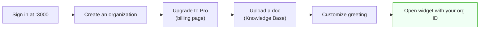

# Setup Guide

A step‑by‑step guide to running the full Echo stack locally: the Convex backend, the operator dashboard, the widget, and (optionally) the embed loader.

> For a conceptual overview first, read [architecture.md](architecture.md). For production, see [deployment.md](deployment.md).

---

## Table of Contents

- [Prerequisites](#prerequisites)
- [Step 1 — Clone & install](#step-1--clone--install)
- [Step 2 — Convex](#step-2--convex)
- [Step 3 — Clerk](#step-3--clerk)
- [Step 4 — Google Gemini](#step-4--google-gemini)
- [Step 5 — Environment variables](#step-5--environment-variables)
- [Step 6 — Optional: Vapi + AWS (voice)](#step-6--optional-vapi--aws-voice)
- [Step 7 — Optional: Sentry](#step-7--optional-sentry)
- [Step 8 — Run everything](#step-8--run-everything)
- [Step 9 — First‑run walkthrough](#step-9--first-run-walkthrough)
- [Troubleshooting](#troubleshooting)

---

## Prerequisites

| Tool    | Version                               |
| ------- | ------------------------------------- |
| Node.js | `>= 20`                               |
| pnpm    | `>= 10.33` (repo pins `pnpm@10.33.4`) |
| Git     | latest                                |

Accounts (free tiers work): **Convex**, **Clerk**, **Google AI Studio**. Optional: **Vapi**, **AWS**, **Sentry**.

---

## Step 1 — Clone & install

```bash
git clone https://github.com/RISHII7/echo.git
cd echo
pnpm install
```

---

## Step 2 — Convex

Convex is the backend and database. Provision a dev deployment:

```bash
pnpm --filter backend dev
```

On first run this logs you in, creates a project, and prints your deployment URL (`https://<name>.convex.cloud`). Keep this terminal running — it hot‑reloads functions. Note the URL for `NEXT_PUBLIC_CONVEX_URL`.

Backend secrets are set on the **Convex dashboard** (Settings → Environment Variables) or via `npx convex env set KEY value` — **not** just in `.env.local`, because functions run on Convex's servers.

---

## Step 3 — Clerk

1. Create a Clerk application and **enable Organizations** (Organizations → Settings).
2. Create a **JWT template named `convex`** (JWT Templates → New → Convex). Copy its **Issuer** URL.
3. From **API Keys**, copy your **Publishable key** (`pk_test_…`) and **Secret key** (`sk_test_…`).
4. (For billing) enable **Billing** and create a plan with the key `pro`.
5. (For the webhook, optional locally) create a webhook endpoint pointing at `<convex-site>/clerk-webhook` subscribed to `subscription.updated`, and copy its **signing secret**.

Set in the **Convex dashboard**:

- `CLERK_JWT_ISSUER_DOMAIN` = the `convex` template's Issuer URL
- `CLERK_SECRET_KEY` = `sk_test_…`
- `CLERK_WEBHOOK_SECRET` = the webhook signing secret (if using billing)

---

## Step 4 — Google Gemini

1. Get an API key from [Google AI Studio](https://aistudio.google.com).
2. Set it in the **Convex dashboard**: `GOOGLE_GENERATIVE_AI_API_KEY`.

This powers the chat agent (`gemini-2.5-flash`), text extraction, and embeddings (`gemini-embedding-001`).

---

## Step 5 — Environment variables

**`apps/web/.env.local`**

```bash
NEXT_PUBLIC_CONVEX_URL=https://<your-deployment>.convex.cloud
NEXT_PUBLIC_CLERK_PUBLISHABLE_KEY=pk_test_...
CLERK_SECRET_KEY=sk_test_...
```

**`apps/widget/.env.local`**

```bash
NEXT_PUBLIC_CONVEX_URL=https://<your-deployment>.convex.cloud
```

**Convex dashboard** (backend): `CLERK_JWT_ISSUER_DOMAIN`, `CLERK_SECRET_KEY`, `CLERK_WEBHOOK_SECRET`, `GOOGLE_GENERATIVE_AI_API_KEY`, and (for voice) `AWS_REGION`, `AWS_ACCESS_KEY_ID`, `AWS_SECRET_ACCESS_KEY`.

---

## Step 6 — Optional: Vapi + AWS (voice)

Voice is a Pro plugin. To enable it:

1. **AWS** — create an IAM user with a policy allowing `secretsmanager:CreateSecret`, `secretsmanager:PutSecretValue`, and `secretsmanager:GetSecretValue` on `arn:aws:secretsmanager:*:*:secret:tenant/*`. Set `AWS_REGION`, `AWS_ACCESS_KEY_ID`, `AWS_SECRET_ACCESS_KEY` in the Convex dashboard.
2. **Vapi** — create an assistant and copy your **public** and **private** API keys from the Vapi dashboard.
3. In Echo, go to **Plugins → Vapi**, connect the keys, then pick the assistant/number in **Widget Customization**.

See [voice.md](voice.md) for the full flow and security model.

---

## Step 7 — Optional: Sentry

For source‑map upload on build, create `apps/web/.env.sentry-build-plugin`:

```bash
SENTRY_AUTH_TOKEN=...
```

The Sentry org/project are configured in `apps/web/next.config.ts`.

---

## Step 8 — Run everything

```bash
# All apps + Convex via Turborepo
pnpm dev
```

or individually:

```bash
pnpm --filter backend dev   # Convex functions (keep running)
pnpm --filter web dev       # Dashboard → http://localhost:3000
pnpm --filter widget dev    # Widget      → http://localhost:3001
pnpm --filter embed dev     # Embed demo  → http://localhost:3002/demo.html
```

---

## Step 9 — First‑run walkthrough



1. Visit `http://localhost:3000`, sign in, and **create an organization**.
2. Copy your **organization ID** from the **Integrations** page (`org_…`).
3. (For AI) subscribe to **Pro** on the billing page so AI features unlock.
4. Under **Knowledge Base**, upload a PDF/TXT so the agent has something to answer from.
5. Under **Widget Customization**, set a greeting and suggestions.
6. Open the widget with your org ID:

   ```
   http://localhost:3001/?organizationId=org_XXXXXXXXXXXXXXXXXXXX
   ```

7. Start a chat and ask a question your uploaded doc answers.

---

## Troubleshooting

| Symptom                                         | Likely cause                                               | Fix                                                                                              |
| ----------------------------------------------- | ---------------------------------------------------------- | ------------------------------------------------------------------------------------------------ |
| Widget shows the **error** screen               | Org ID invalid or `organizations.validate` failing         | Check the `?organizationId=` value; ensure `CLERK_SECRET_KEY` is set **in the Convex dashboard** |
| Widget stuck on **loading**                     | Missing `NEXT_PUBLIC_CONVEX_URL` in the widget             | Add it to `apps/widget/.env.local`                                                               |
| AI never responds                               | No active subscription, or conversation escalated/resolved | Subscribe to Pro; check conversation status                                                      |
| File upload fails                               | Not on Pro, or Gemini key missing                          | Subscribe; set `GOOGLE_GENERATIVE_AI_API_KEY` in Convex                                          |
| Embedding errors on upload                      | Wrong embedding model/dimension                            | Uses `gemini-embedding-001` at 1536‑dim by design                                                |
| Voice option missing                            | No Vapi plugin / assistant configured                      | Connect Vapi and pick an assistant in Customization                                              |
| `AccessDenied` from AWS                         | IAM policy missing `GetSecretValue`                        | Add the Secrets Manager permissions above                                                        |
| Convex function has stale env                   | Secret only in `.env.local`                                | Set it in the Convex dashboard (`npx convex env set`)                                            |
| Editor shows phantom type errors after installs | Stale TS server / `.next` cache                            | Restart the TS server; delete `apps/web/.next` if needed                                         |

---

**Next:** [Deployment Guide](deployment.md) · [Embedding the Widget](embedding.md)
