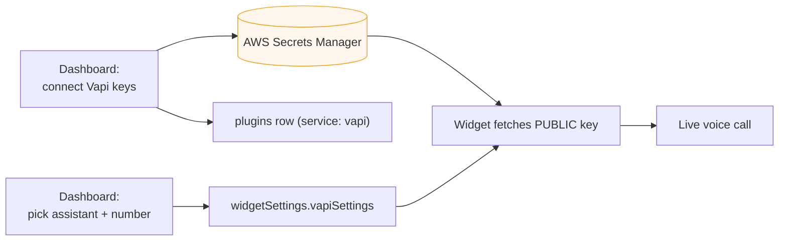
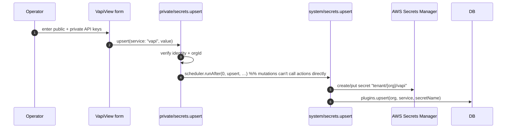
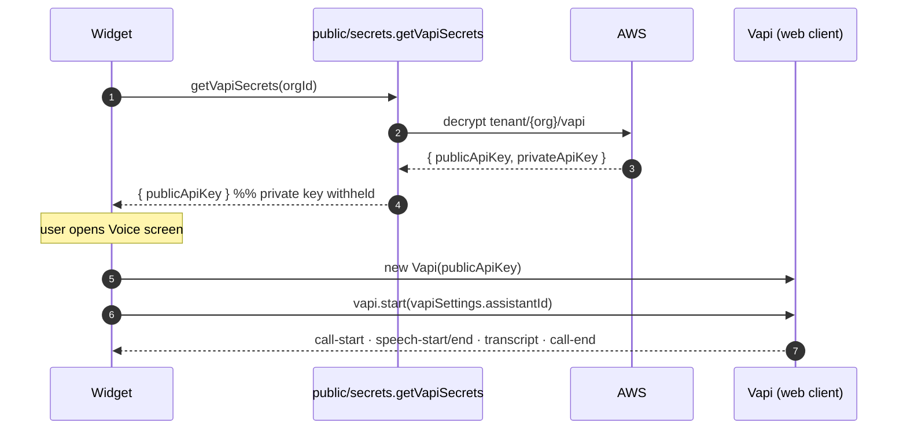
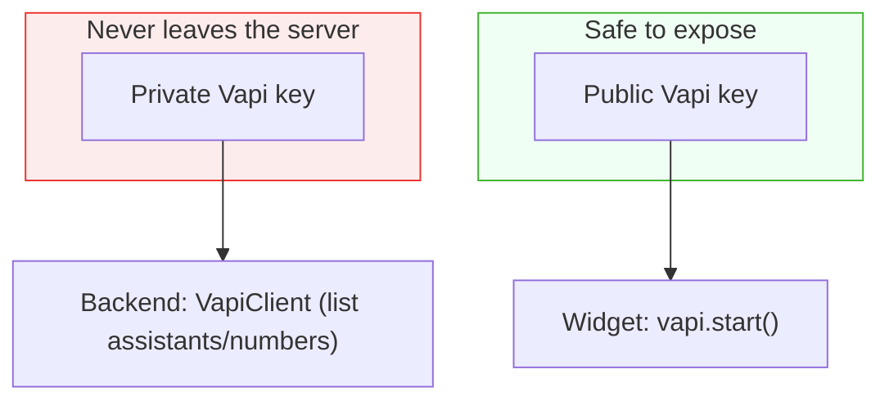

# Voice (Vapi)

Echo integrates [Vapi](https://vapi.ai) to offer **live voice conversations** inside the widget, plus a tap‑to‑call phone option. This doc covers how an organization connects Vapi, how credentials are secured, and the call lifecycle.

---

## Table of Contents

- [Overview](#overview)
- [Connecting Vapi (dashboard)](#connecting-vapi-dashboard)
- [Secret handling](#secret-handling)
- [Widget voice call lifecycle](#widget-voice-call-lifecycle)
- [The contact (phone) screen](#the-contact-phone-screen)
- [Managing assistants & numbers](#managing-assistants--numbers)
- [Security model](#security-model)

---

## Overview

Voice is a **Pro‑tier, opt‑in plugin**. When an organization connects Vapi and configures an assistant in Widget Customization, the widget's selection screen surfaces **"Start voice call"** (and **"Call us"** if a phone number is set).

---

## Connecting Vapi (dashboard)

On the **Plugins → Vapi** page, an operator connects Vapi by submitting a **public** and **private** API key. The form calls `private/secrets.upsert`, which schedules the encrypted write.

Mutations can't perform external I/O directly, so `private/secrets.upsert` **schedules** the internal action `system/secrets.upsert`, which does the AWS write and records the `plugins` row.

---

## Secret handling

Credentials never touch the database or the browser in plaintext:

| Where                      | What's stored                                                       |
| -------------------------- | ------------------------------------------------------------------- |
| **AWS Secrets Manager**    | `{ publicApiKey, privateApiKey }` at `tenant/{organizationId}/vapi` |
| **Convex `plugins` table** | Only the `secretName` (a pointer), plus org + service               |
| **Widget**                 | Only the **public** key, fetched at load                            |
| **Backend actions**        | The **private** key, in memory, only when calling Vapi's server SDK |

`system/secrets.ts` uses `upsertSecret` (create, falling back to update on `ResourceExistsException`) from [`lib/secrets.ts`](../packages/backend/convex/lib/secrets.ts).

---

## Widget voice call lifecycle

When the widget loads, `WidgetLoadingScreen` fetches the org's **public** Vapi key via `public/secrets.getVapiSecrets` (which returns _only_ the public key). If present, `hasVapiSecretsAtom` unlocks the voice option.

The `useVapi` hook ([`apps/widget/modules/widget/hooks/use-vapi.ts`](../apps/widget/modules/widget/hooks/use-vapi.ts)) manages the client and exposes `isConnected`, `isConnecting`, `isSpeaking`, `transcript`, `startCall`, and `endCall`. `WidgetVoiceScreen` renders:

- A **live transcript** (or an empty "transcript will appear here" state).
- A **speaking/listening indicator** (pulsing red when the assistant speaks, green when listening).
- A single button that swaps between **Start call** and **End call**.

`startCall` requires both a public key and a configured `assistantId`; otherwise it's a no‑op.

---

## The contact (phone) screen

If `widgetSettings.vapiSettings.phoneNumber` is set, the selection screen offers **"Call us"**, routing to `WidgetContactScreen`, which shows the number with:

- **Copy Number** — `navigator.clipboard`, with a 2‑second "Copied!" confirmation.
- **Call Now** — a `tel:` link.

---

## Managing assistants & numbers

The dashboard's connected Vapi view lists the org's Vapi resources in tabbed tables, powered by server‑side actions that use the **private** key:

| Action                         | Returns                                                |
| ------------------------------ | ------------------------------------------------------ |
| `private/vapi.getAssistants`   | The org's Vapi assistants (name, model, first message) |
| `private/vapi.getPhoneNumbers` | The org's Vapi phone numbers (number, name, status)    |

Both resolve the org's plugin, decrypt the secret, and call `@vapi-ai/server-sdk`'s `VapiClient` with the private key. The dashboard hooks (`useVapiAssistants`, `useVapiPhoneNumbers`) wrap these actions with loading/error state.

The Widget Customization form then lets the operator pick which assistant and phone number the widget should use, storing them in `widgetSettings.vapiSettings`.

---

## Security model

- The **private key** is used only in backend actions (`private/vapi.*`), never returned to a client.
- The **public key** is the only credential the widget receives, via `public/secrets.getVapiSecrets`.
- Requires `AWS_REGION`, `AWS_ACCESS_KEY_ID`, and `AWS_SECRET_ACCESS_KEY` in the Convex environment, and the IAM user needs `secretsmanager:CreateSecret`, `PutSecretValue`, and `GetSecretValue`.

---

**Next:** [Widget & Embed](widget.md) · [Billing & Subscriptions](billing.md) · [Setup Guide](setup.md)
