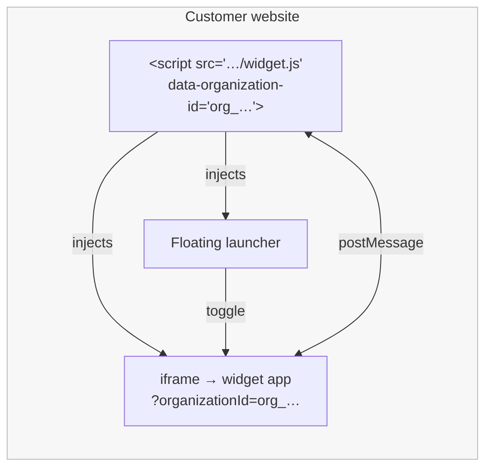
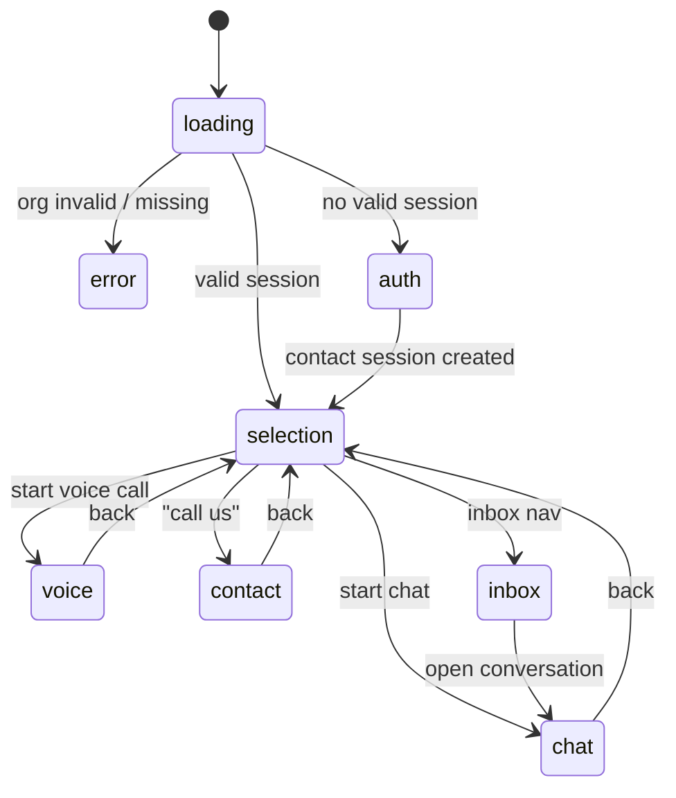
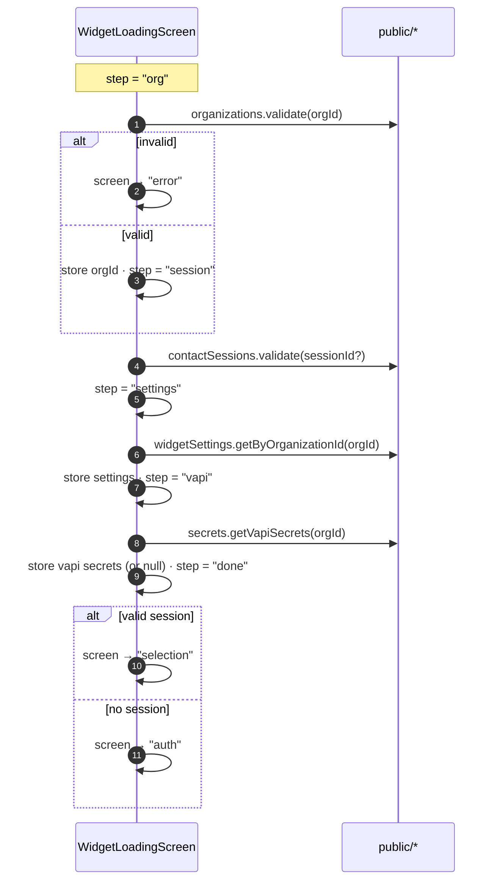

# Widget & Embed

Echo's visitor‑facing surface is two cooperating pieces:

- **`apps/widget`** — a Next.js app that renders the actual chat/voice UI inside an iframe. It's a **Jotai‑driven state machine** with one screen per state.
- **`apps/embed`** — a tiny, dependency‑free loader (built with Vite as an IIFE) that a customer drops onto their website with one `<script>` tag. It injects a launcher button and an iframe pointing at the widget.

---

## Table of Contents

- [How the two pieces fit](#how-the-two-pieces-fit)
- [The embed loader](#the-embed-loader)
- [The widget state machine](#the-widget-state-machine)
- [Screens](#screens)
- [Widget atoms](#widget-atoms)
- [Bootstrap sequence](#bootstrap-sequence)
- [Suggestions & greeting](#suggestions--greeting)
- [host ↔ widget messaging](#host--widget-messaging)

---

## How the two pieces fit



The loader is intentionally dumb: it only manages the launcher, the iframe, and `postMessage`. **All product logic lives in the widget app**, which keeps the embed script tiny and stable (customers rarely need to update the tag).

---

## The embed loader

Source: [`apps/embed/embed.ts`](../apps/embed/embed.ts). Built to `dist/widget.iife.js` and shipped as `apps/widget/public/widget.js` (served at `/widget.js`).

**Configuration** is read from the script tag's attributes:

| Attribute              | Values                          | Default        |
| ---------------------- | ------------------------------- | -------------- |
| `data-organization-id` | Your Clerk org ID (`org_…`)     | **required**   |
| `data-position`        | `bottom-right` \| `bottom-left` | `bottom-right` |

**What it does on load:**

1. Reads config from `document.currentScript` (with a `src*="embed"` fallback lookup).
2. If no org ID, logs an error and bails.
3. Injects a fixed‑position **launcher button** (chat‑bubble icon, blue).
4. Injects a hidden, animated **iframe container** pointing at `${WIDGET_URL}?organizationId=…`, with `allow="microphone; clipboard-read; clipboard-write"` for voice.
5. Listens for `postMessage` events (`close`, `resize`) from the widget.
6. Exposes a global API.

**`window.EchoWidget` API:**

```js
window.EchoWidget.init({ organizationId, position }) // destroy + re-render with new config
window.EchoWidget.show() // open the panel
window.EchoWidget.hide() // close the panel
window.EchoWidget.destroy() // remove button + iframe, detach listeners
```

Clicking the launcher toggles the panel with a fade/translate animation and swaps the icon (chat ↔ close).

> **Dev vs. prod:** `EMBED_CONFIG.WIDGET_URL` comes from `VITE_WIDGET_URL` (default `http://localhost:3001`). Set it to your production widget host before building for release. The Integrations page snippets similarly hard‑code `http://localhost:3001/widget.js` today — swap for your host on deploy (see [deployment.md](deployment.md)).

---

## The widget state machine

The widget renders exactly one **screen** at a time, chosen by `screenAtom`. `WidgetView` is a switch over the current screen:



`WIDGET_SCREENS` (in `modules/widget/constants`) enumerates all eight states: `error`, `loading`, `selection`, `voice`, `auth`, `inbox`, `chat`, `contact`.

---

## Screens

| Screen        | Component               | Purpose                                                                                          |
| ------------- | ----------------------- | ------------------------------------------------------------------------------------------------ |
| **loading**   | `WidgetLoadingScreen`   | Runs the multi‑step bootstrap (org → session → settings → voice), showing live progress messages |
| **error**     | `WidgetErrorScreen`     | Terminal state for invalid configuration (e.g. bad org ID)                                       |
| **auth**      | `WidgetAuthScreen`      | Collects name + email, captures browser metadata, creates a contact session                      |
| **selection** | `WidgetSelectionScreen` | Entry hub: Start chat, Start voice call (if configured), Call us (if configured); footer nav     |
| **chat**      | `WidgetChatScreen`      | The AI Elements chat UI with infinite scroll, suggestions, and Dicebear avatars                  |
| **voice**     | `WidgetVoiceScreen`     | Live Vapi call: transcript, speaking/listening indicator, start/end button                       |
| **contact**   | `WidgetContactScreen`   | Displays the org's phone number with copy + tap‑to‑call                                          |
| **inbox**     | `WidgetInboxScreen`     | The visitor's own past conversations, paginated with status icons                                |

---

## Widget atoms

State lives in Jotai atoms ([`modules/widget/atoms/widget-atoms`](../apps/widget/modules/widget/atoms/widget-atoms/index.ts)):

| Atom                                     | Type                            | Role                                                                                   |
| ---------------------------------------- | ------------------------------- | -------------------------------------------------------------------------------------- |
| `screenAtom`                             | `WidgetScreen`                  | Which screen renders (starts `"loading"`)                                              |
| `organizationIdAtom`                     | `string \| null`                | Set after org validation                                                               |
| `contactSessionIdAtomFamily(orgId)`      | `Id \| null`                    | **Per‑org**, `localStorage`‑backed session ID (via `jotai-family` + `atomWithStorage`) |
| `widgetSettingsAtom`                     | `Doc<"widgetSettings"> \| null` | Greeting + suggestions + Vapi settings                                                 |
| `conversationIdAtom`                     | `Id \| null`                    | The active conversation                                                                |
| `vapiSecretsAtom`                        | `{ publicApiKey } \| null`      | Set if the org has Vapi connected                                                      |
| `hasVapiSecretsAtom`                     | derived `boolean`               | Gate for voice UI                                                                      |
| `errorMessageAtom`, `loadingMessageAtom` | `string \| null`                | Screen copy                                                                            |

The per‑org `contactSessionIdAtomFamily` keyed by `CONTACT_SESSION_KEY_{orgId}` means a browser can hold separate sessions for different organizations' widgets without collision.

---

## Bootstrap sequence

`WidgetLoadingScreen` advances through explicit steps, updating the loading message at each:



The **vapi** step is optional — a missing/failed voice connection never blocks reaching `done`; it just means the voice option won't appear.

---

## Suggestions & greeting

- The **greeting** is seeded server‑side when the conversation is created (`conversations.create` reads `widgetSettings.greetMessage`).
- **Quick‑reply suggestions** come from `widgetSettings.defaultSuggestions` and render as clickable chips in `WidgetChatScreen` — but **only on the first message** of a conversation. Clicking one fills and immediately submits the message form.

---

## host ↔ widget messaging

The widget and the host page coordinate via `postMessage`, origin‑checked against the widget URL:

| Message `type` | Direction     | Effect                                                    |
| -------------- | ------------- | --------------------------------------------------------- |
| `close`        | widget → host | Host hides the panel                                      |
| `resize`       | widget → host | Host sets the iframe container height to `payload.height` |

This lets the widget request its own dismissal or a height change without the host needing to know anything about the widget's internals.

---

**Next:** [Voice (Vapi)](voice.md) · [Conversation Flows](conversation-flows.md) · [Embedding the Widget](embedding.md)
